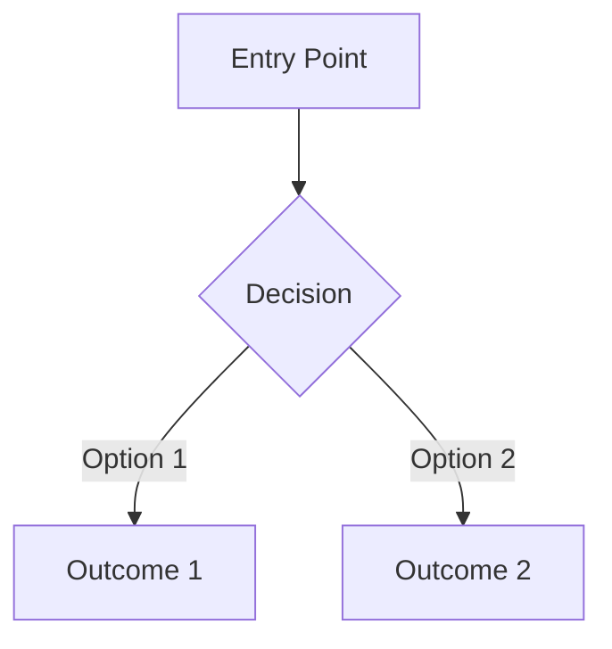
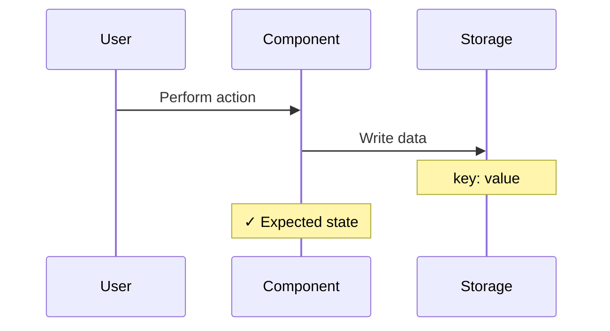

# Generate Test Flow Documentation

Create a companion `.md` file co-located with the test file (e.g., `cookie-consent.spec.ts` → `cookie-consent.md`).

## Input

The user provides a test file path. Read the test file and any related source files (components, utilities) to understand the full context.

## Output Structure

Generate a Markdown document with this structure:

### 1. Title & Introduction

```markdown
# {Test Suite Name} Integration Tests

> Test flow documentation for [`{filename}`]({filename})

Brief description of what the test suite covers.
```

### 2. Data Model (if applicable)

Document any data structures, storage keys, or state shapes the tests rely on. Use a table for properties and a JSON code block for shape examples.

### 3. Overview Flowchart

A single Mermaid `flowchart TD` showing the full user decision tree covered by the test suite. Show all major paths from entry point through user actions to outcomes.

````markdown

````

### 4. Test Setup

Document the `beforeEach`/`beforeAll` hooks and any helper functions:

- What state is cleared or initialized
- What helpers exist and what they do
- Any wait times or animation considerations

### 5. Per Test Case

For **each** test case, include:

#### Heading

Use the test's `it`/`test` description as the heading.

#### Purpose

1–2 sentences explaining what the test validates and why it matters.

#### Step-by-Step Flow

A numbered list of actions and assertions matching the test code:

1. Action the user or system takes.
2. Assertion verifying the expected outcome.

#### Sequence Diagram

A Mermaid `sequenceDiagram` showing actor interactions. Use participants relevant to the test, such as:

- `U as User` — the person interacting
- `P as Page` — the browser page
- `C as Component` — the UI component under test
- `S as Storage` — localStorage, cookies, or other persistence
- `API as API` — any backend calls

Use `Note over` blocks for assertion checkpoints (prefix with ✓).

````markdown

````

#### Supplementary Flowchart (optional)

For tests involving decision branches, state transitions, or multi-step toggles, add a `flowchart LR` or `flowchart TD` showing the decision path.

## Guidelines

- **Abbreviations in diagrams:** Use short labels (e.g., `SN` for "strictly-necessary", `AN` for "analytics") and define them on first use.
- **Assertions:** Mark all assertion checkpoints with ✓ in `Note over` blocks.
- **Consistency:** Use the same participant names across all diagrams in the document.
- **Animations/waits:** Document any timing dependencies (e.g., Framer Motion animation durations, debounce timers).
- **Cross-references:** Link to the source test file and line numbers where helpful.
- **Keep diagrams focused:** Each diagram should illustrate one test case. Don't combine unrelated tests.
- **No implementation details:** Document the _what_ and _why_, not internal component code. The audience is someone reading the test suite for the first time.

## Example

See [`tests/integration/cookie-consent.md`](/tests/integration/cookie-consent.md) for a complete example of this format applied to the cookie consent integration tests.
