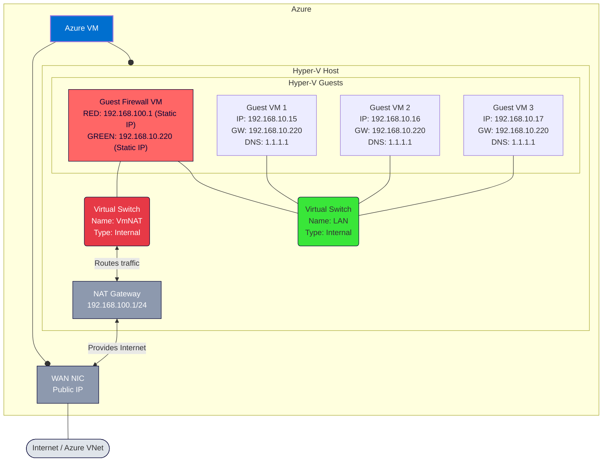

> **Goal:** Give your Hyper‑V guest(s) running **inside** an Azure VM Hyper-V
> host outbound Internet (and optional inbound) without touching Azure
> networking beyond the outer VM’s NIC.

## Architecture

<!-- markdownlint-disable MD013 -->

<!-- markdownlint-enable MD013 -->

## Prerequisites

<!-- markdownlint-disable MD013 -->
| Item           | Notes                                                                           |
| -------------- | ------------------------------------------------------------------------------- |
| Azure VM size  | Needs to support nested hypervisor — e.g. Standard E8-4ads v5 with 64 GB memory |
| OS in the host | Windows 11, Windows Server 2019 or later with Hyper‑V.                          |
| Admin rights   | All commands run in an **elevated** PowerShell prompt on the host.              |
| ⚠️ Security    | NAT hides guests from Azure’s NSG layer. Still apply guest firewalls/updates!   |
<!-- markdownlint-enable MD013 -->

## 1 . Create an Internal switch

<!-- markdownlint-disable MD013 -->
```powershell
# Bind the new internal switch to the host's physical NIC
# Replace '<Host-NIC-Name>' with the name shown in Get-NetAdapter (e.g., 'Ethernet')
New-VMSwitch -Name VmNAT -NetAdapterName '<Host-NIC-Name>' -AllowManagementOS $true -SwitchType Internal
```
<!-- markdownlint-enable MD013 -->

## 2 . Give the host‑side vNIC an IP

<!-- markdownlint-disable MD013 -->
```powershell
New-NetIPAddress -InterfaceAlias 'vEthernet (VmNAT)' `
                 -IPAddress 192.168.100.1 -PrefixLength 24
Get-NetIPAddress -InterfaceAlias 'vEthernet (VmNAT)'
```
<!-- markdownlint-enable MD013 -->

> [!IMPORTANT]
> Choose any RFC1918 /24 that does not clash with your virtual or on-premises
> networks.

## 3. Build the NAT

<!-- markdownlint-disable MD013 -->
```powershell
New-NetNat -Name VmNAT -InternalIPInterfaceAddressPrefix 192.168.100.0/24
# Verify it exists
Get-NetNat -Name VmNAT
```
<!-- markdownlint-enable MD013 -->

> [!IMPORTANT]
> • **One NAT per prefix** only. If you re-run, delete the old first:
> `Remove-NetNat -Name VmNAT`

## 4 . Attach the nested VM to the switch

<!-- markdownlint-disable MD013 -->
```powershell
$fwName = '<name of firewall vm>'
Get-VMNetworkAdapter -VMName $fwName
Get-VMNetworkAdapter -VMName $fwName |
  Where-Object MacAddress -eq 'set to MAC address of firewall RED NIC' |
    Connect-VMNetworkAdapter -SwitchName VmNat
```
<!-- markdownlint-enable MD013 -->

Repeat for each guest that should use NAT.

## 5 . Configure the nested VM’s NIC

Hand out DHCP addresses, or assign a static address.

### Option 1 - Static IP address

Inside the firewall guest OS, set the RED NIC to use a static IP. The gateway
will be the VmNAT's IP address:

<!-- markdownlint-disable MD013 -->
| Setting     | Value (example)                                                                |
| ----------- | ------------------------------------------------------------------------------ |
| **IP**      | 192.168.100.10                                                                 |
| **Mask**    | 255.255.255.0                                                                  |
| **Gateway** | 192.168.100.1                                                                  |
| **DNS**     | 1.1.1.1 (or set to another guest's IP, if that guest VM forward DNS requests.) |
<!-- markdownlint-enable MD013 -->

### Option 2 - DHCP Server

Install the **DHCP Server** role on the Hyper-V host, add a scope for
**192.168.100.0/24** and the guests will lease automatically.

## 6 . (Optional) Port‑forward inbound traffic

<!-- markdownlint-disable MD013 -->
```powershell
# RDP to nested VM (hostPublicIP:4022 → 192.168.100.10:3389)
Add-NetNatStaticMapping -NatName VmNAT -Protocol TCP `
    -ExternalIPAddress 0.0.0.0 -ExternalPort 4022 `
    -InternalIPAddress 192.168.100.10 -InternalPort 3389
```
<!-- markdownlint-enable MD013 -->

Then **allow the same port** in the Azure NSG attached to the host NIC or
subnet.

## 7 . Persistence & automation

- NAT objects survive reboot, but load **after** networking comes up.
  If a guest starts too quickly it may time out; set an automatic start delay
  first (e.g., `Set-VM -Name MyNestedVM -AutomaticStartDelay 30`), then start
  the VM normally (`Start-VM -Name MyNestedVM`); alternatively, schedule a
  NAT-creation script at logon.
- To bake it into a golden image, place steps 1‑3 in `SetupComplete.cmd` or a
  first‑boot script.

## Troubleshooting Checklist

<!-- markdownlint-disable MD013 -->
| Step                | Command (host)                                         | Expect                      | Fix if wrong                             |
| ------------------- | ------------------------------------------------------ | --------------------------- | ---------------------------------------- |
| **Host IP**         | `Get-NetIPAddress -InterfaceAlias "vEthernet (VmNAT)"` | 192.168.100.1/24            | Re‑create with correct address           |
| **NAT exists**      | `Get-NetNat`                                           | Prefix **192.168.100.0/24** | `Remove-NetNat -Name VmNAT`, then re‑add |
| **Gateway ping**    | _(inside guest)_ `ping 192.168.100.1`                  | Replies                     | Re‑attach NIC to VmNAT                   |
| **Active sessions** | `Get-NetNat \| fl Active*`                             | > 0 after guest traffic     | Firewall/DNS blocking, or NatSvc stuck   |
| **DNS**             | `nslookup microsoft.com` in guest                      | Resolves                    | Use public DNS or host DNS               |
| **NAT service**     | `Restart-Service ipnat`                                | Restarts cleanly            | Service disabled/crashed—set to Auto     |
<!-- markdownlint-enable MD013 -->

> **Still stuck?**
>
> 1. Verify the host itself reaches Internet.
> 2. Check Azure NSG outbound rules (default is _AllowAll_).
> 3. Temporarily disable Windows Firewall in both host & guest (then
>    re‑enable!).

## Quick “Reset & Rebuild” Script

<!-- markdownlint-disable MD013 -->
```powershell
# Danger: removes any switches or NATs named VmNAT
Remove-VMSwitch -Name VmNAT -Force -Confirm:$false
Get-NetNat -Name VmNAT -ErrorAction SilentlyContinue | Remove-NetNat

# Replace '<Host-NIC-Name>' with the name shown in Get-NetAdapter (e.g., 'Ethernet')
New-VMSwitch -Name VmNAT -NetAdapterName '<Host-NIC-Name>' -AllowManagementOS $true -SwitchType Internal
New-NetIPAddress -InterfaceAlias 'vEthernet (VmNAT)' `
                 -IPAddress 192.168.100.1 -PrefixLength 24
New-NetNat -Name VmNAT -InternalIPInterfaceAddressPrefix 192.168.100.0/24
```
<!-- markdownlint-enable MD013 -->

Attach guest NICs again and you’re back online.

## Appendix – Useful One‑Liners

<!-- markdownlint-disable MD013 -->
```powershell
# List all NAT sessions
Get-NetNatSession | ft -AutoSize

# Show VM → switch associations
Get-VMNetworkAdapter | select VMName, SwitchName, MacAddress
```
<!-- markdownlint-enable MD013 -->
