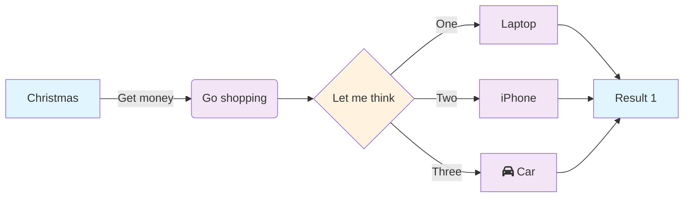

Mermaid is a powerful diagramming and charting tool that uses simple text definitions to create complex visual diagrams. This comprehensive guide covers every type of Mermaid diagram with practical examples that you can use in your own projects.

## Introduction

Mermaid diagrams are perfect for technical documentation, project planning, system architecture, and process visualization. They render directly in markdown, making them ideal for documentation that lives alongside your code.

This guide demonstrates all available Mermaid diagram types with real-world examples, syntax explanations, and best practices.

There are more examples in the [Documentation](https://mermaid.js.org/syntax/examples.html).

## 1. Flowcharts

[Documentation](https://mermaid.js.org/syntax/flowchart.html)

Flowcharts are the most common type of diagram, perfect for showing processes, decision trees, and workflows.

### Basic Flowchart


### Advanced Flowchart with Styling



### Subgraphs in Flowcharts


## 2. Sequence Diagrams

[Documentation](https://mermaid.js.org/syntax/sequenceDiagram.html)

Sequence diagrams show interactions between different actors over time, perfect for API documentation and system interactions.

### Basic Sequence Diagram


### Advanced Sequence with Authentication Flow


### Sequence with Activation Boxes


## 3. Class Diagrams

[Documentation](https://mermaid.js.org/syntax/classDiagram.html)

Class diagrams show the structure of systems by displaying classes, their attributes, methods, and relationships.

### Basic Class Diagram


### Advanced Class Diagram with Relationships


### Class Diagram with Annotations


## 4. State Diagrams

[Documentation](https://mermaid.js.org/syntax/stateDiagram.html)

State diagrams show the different states of an object and transitions between them.

### Basic State Diagram


### Advanced State Diagram with Conditions


### State Diagram with Choice and Fork


## 5. Entity Relationship Diagrams (ERD)

[Documentation](https://mermaid.js.org/syntax/entityRelationshipDiagram.html)

ERDs show the relationships between entities in a database.

### Basic ERD


### Advanced ERD with Attributes


## 6. User Journey Diagrams

[Documentation](https://mermaid.js.org/syntax/userJourney.html)

User journey diagrams show the path users take through a process or system.

### Basic User Journey


### Advanced User Journey - E-commerce Experience


## 7. Gantt Charts

[Documentation](https://mermaid.js.org/syntax/gantt.html)

Gantt charts show project timelines and task dependencies.

### Basic Gantt Chart


### Advanced Project Gantt Chart


## 8. Pie Charts

[Documentation](https://mermaid.js.org/syntax/pie.html)

Pie charts show proportional data and percentages.

### Basic Pie Chart


### Advanced Pie Chart - Market Share


## 9. Quadrant Charts

[Documentation](https://mermaid.js.org/syntax/quadrantChart.html)

Quadrant charts help with decision-making by plotting items on two axes.

### Basic Quadrant Chart

```mermaid
quadrantChart
    title Reach and influence
    x-axis Low Reach --> High Reach
    y-axis Low Influence --> High Influence
    quadrant-1 We should expand
    quadrant-2 Need to promote
    quadrant-3 Re-evaluate
    quadrant-4 May be improved
    Campaign A: [0.3, 0.6]
    Campaign B: [0.45, 0.23]
    Campaign C: [0.57, 0.69]
    Campaign D: [0.78, 0.34]
    Campaign E: [0.40, 0.34]
```

### Strategic Planning Quadrant

```mermaid
quadrantChart
    title Product Portfolio Analysis
    x-axis Low Market Growth --> High Market Growth
    y-axis Low Market Share --> High Market Share
    quadrant-1 Stars
    quadrant-2 Question Marks
    quadrant-3 Dogs
    quadrant-4 Cash Cows
    Product A: [0.8, 0.7]
    Product B: [0.2, 0.8]
    Product C: [0.3, 0.2]
    Product D: [0.7, 0.3]
    Product E: [0.5, 0.6]
```

## 10. Requirement Diagrams

[Documentation](https://mermaid.js.org/syntax/requirementDiagram.html)

Requirement diagrams show requirements and their relationships.

### Basic Requirement Diagram

```mermaid
requirementDiagram
requirement test_req {
  id: "1"
  text: "the test text."
  risk: high
  verifymethod: test
}

element test_entity {
  type: simulation
}

test_entity - satisfies -> test_req
```

### Advanced System Requirements

```mermaid
requirementDiagram
requirement user_authentication {
  id: "REQ-001"
  text: "System shall authenticate users"
  risk: high
  verifymethod: test
}

requirement password_policy {
  id: "REQ-002"
  text: "Passwords must be at least 8 characters"
  risk: medium
  verifymethod: inspection
}

requirement session_timeout {
  id: "REQ-003"
  text: "Sessions timeout after 30 minutes"
  risk: medium
  verifymethod: test
}

element authentication_service {
  type: service
}

element password_validator {
  type: component
}

element session_manager {
  type: component
}

authentication_service - satisfies -> user_authentication
password_validator - satisfies -> password_policy
session_manager - satisfies -> session_timeout

user_authentication - derives -> password_policy
user_authentication - derives -> session_timeout
```

## 11. Gitgraph Diagrams

[Documentation](https://mermaid.js.org/syntax/gitgraph.html)

Gitgraph diagrams show Git branching and merging workflows.

### Basic Git Flow

```mermaid
gitGraph
    commit
    commit
    branch develop
    checkout develop
    commit
    commit
    checkout main
    merge develop
    commit
    commit
```

### Advanced Git Workflow

```mermaid
gitGraph
    commit id: "Initial commit"
    commit id: "Add basic structure"

    branch develop
    checkout develop
    commit id: "Setup development"

    branch feature/user-auth
    checkout feature/user-auth
    commit id: "Add login form"
    commit id: "Implement authentication"

    checkout develop
    merge feature/user-auth

    branch feature/dashboard
    checkout feature/dashboard
    commit id: "Create dashboard layout"
    commit id: "Add widgets"

    checkout develop
    commit id: "Fix bug in auth"

    checkout feature/dashboard
    merge develop
    commit id: "Update dashboard"

    checkout develop
    merge feature/dashboard

    checkout main
    merge develop
    commit id: "Release v1.0"
```

```mermaid
gitGraph
  commit
  branch hotfix
  checkout hotfix
  commit
  branch develop
  checkout develop
  commit id:"ash" tag:"abc"
  branch featureB
  checkout featureB
  commit type:HIGHLIGHT
  checkout main
  checkout hotfix
  commit type:NORMAL
  checkout develop
  commit type:REVERSE
  checkout featureB
  commit
  checkout main
  merge hotfix
  checkout featureB
  commit
  checkout develop
  branch featureA
  commit
  checkout develop
  merge hotfix
  checkout featureA
  commit
  checkout featureB
  commit
  checkout develop
  merge featureA
  branch release
  checkout release
  commit
  checkout main
  commit
  checkout release
  merge main
  checkout develop
  merge release
```

## 12. C4 Diagrams

[Documentation](https://mermaid.js.org/syntax/c4.html)

C4 diagrams show software architecture at different levels of abstraction.

### C4 Context Diagram

```mermaid
C4Context
    title System Context diagram for Internet Banking System

    Person(customerA, "Banking Customer A", "A customer of the bank, with personal bank accounts.")
    Person(customerB, "Banking Customer B")
    Person_Ext(customerC, "Banking Customer C", "desc")

    Person(customerD, "Banking Customer D", "A customer of the bank, <br/> with personal bank accounts.")

    System(SystemAA, "Internet Banking System", "Allows customers to view information about their bank accounts, and make payments.")

    System_Ext(SystemE, "Mainframe Banking System", "Stores all of the core banking information about customers, accounts, transactions, etc.")

    System_Ext(SystemC, "E-mail system", "The internal Microsoft Exchange e-mail system.")
    System_Ext(SystemD, "ATM", "Allows customers to withdraw cash.")

    Rel(customerA, SystemAA, "Uses")
    Rel(SystemAA, SystemE, "Uses")
    Rel(SystemAA, SystemC, "Sends e-mails", "SMTP")
    Rel(customerC, SystemD, "Withdraws cash", "ATM")

    UpdateElementStyle(customerA, $fontColor="red", $bgColor="grey", $borderColor="red")
    UpdateRelStyle(customerA, SystemAA, $textColor="blue", $lineColor="blue", $offsetX="5")
    UpdateRelStyle(SystemAA, SystemE, $textColor="blue", $lineColor="blue", $offsetY="-10")
    UpdateRelStyle(SystemAA, SystemC, $textColor="blue", $lineColor="blue", $offsetY="-40", $offsetX="-50")
    UpdateRelStyle(customerC, SystemD, $textColor="red", $lineColor="red", $offsetX="-50", $offsetY="20")

    UpdateLayoutConfig($c4ShapeInRow="3", $c4BoundaryInRow="1")
```

## 13. Mind Maps

[Documentation](https://mermaid.js.org/syntax/mindmap.html)

Mind maps show hierarchical information radiating from a central concept.

### Basic Mind Map

```mermaid
mindmap
  root((mindmap))
    Origins
      Long history
      ::icon(fa fa-book)
      Popularisation
        British popular psychology author Tony Buzan
    Research
      On effectiveness<br/>and features
      On Automatic creation
        Uses
            Creative techniques
            Strategic planning
            Argument mapping
    Tools
      Pen and paper
      Mermaid
```

### Project Planning Mind Map

```mermaid
mindmap
  root((Web Application))
    Frontend
      React
        Components
        Hooks
        State Management
      Styling
        CSS
        Tailwind
        Responsive Design
      Testing
        Jest
        Testing Library
    Backend
      Node.js
        Express
        Middleware
        Authentication
      Database
        PostgreSQL
        MongoDB
        Redis
      API
        REST
        GraphQL
        WebSocket
    DevOps
      CI/CD
        GitHub Actions
        Jenkins
      Deployment
        Docker
        Kubernetes
        AWS
      Monitoring
        Logging
        Metrics
        Alerts
```

## 14. Timeline Diagrams

[Documentation](https://mermaid.js.org/syntax/timeline.html)

Timeline diagrams show events over time.

### Basic Timeline

```mermaid
timeline
    title History of Social VR
    2014 : Facebook acquires Oculus
         : Samsung Gear VR
    2016 : HTC Vive
         : PlayStation VR
         : Google Daydream
    2018 : Oculus Go
         : Vive Pro
    2019 : Oculus Rift S
         : Quest
    2020 : Quest 2
```

### Product Development Timeline

```mermaid
timeline
    title Product Development Lifecycle

    section Research Phase
        Q1 2024 : Market Research
                : User Interviews
                : Competitive Analysis

    section Design Phase
        Q2 2024 : Wireframes
                : Prototypes
                : User Testing

    section Development Phase
        Q3 2024 : MVP Development
                : Alpha Testing
                : Beta Release

    section Launch Phase
        Q4 2024 : Product Launch
                : Marketing Campaign
                : Customer Feedback

    section Growth Phase
        Q1 2025 : Feature Updates
                : Market Expansion
                : Performance Optimization
```

## zenUML

[Documentation](https://mermaid.js.org/syntax/zenuml.html)

A Sequence diagram is an interaction diagram that shows how processes operate with one another and in what order.

These types of diagrams are not supported by the blog system yet, they throw an error:

```plaintext
No diagram type detected matching given configuration for text: zenuml
```

Example mermaid code for this type of diagram:

```text
zenuml
    // 1. assign a variable from a sync message.
    a = A.SyncMessage()

    // 1.1. optionally give the variable a type
    SomeType a = A.SyncMessage()

    // 2. use return keyword
    A.SyncMessage() {
    return result
    }

    // 3. use @return or @reply annotator on an async message
    @return
    A->B: result
```

## 15. Sankey Diagrams

[Documentation](https://mermaid.js.org/syntax/sankey.html)

Sankey diagrams show flow and quantity through a system.

### Basic Sankey Diagram

```mermaid
sankey-beta
    Agriculture,Bio-conversion,124.729
    Bio-conversion,Liquid,0.597
    Bio-conversion,Losses,26.862
    Bio-conversion,Solid,280.322
    Bio-conversion,Gas,81.144
```

### Energy Flow Sankey

```mermaid
sankey-beta
    Coal,Electricity Generation,50
    Natural Gas,Electricity Generation,30
    Nuclear,Electricity Generation,15
    Renewables,Electricity Generation,25

    Electricity Generation,Residential,35
    Electricity Generation,Commercial,25
    Electricity Generation,Industrial,45
    Electricity Generation,Transportation,5
    Electricity Generation,Losses,10

    Oil,Transportation,40
    Oil,Industrial,15
    Oil,Residential,5

    Natural Gas,Residential,20
    Natural Gas,Commercial,15
    Natural Gas,Industrial,10
```

## 16. XY Charts

[Documentation](https://mermaid.js.org/syntax/xyChart.html)

XY charts show relationships between two quantitative variables.

### Basic XY Chart

```mermaid
xychart-beta
    title "Sales Revenue"
    x-axis [Jan, Feb, Mar, Apr, May, Jun, Jul, Aug, Sep, Oct, Nov, Dec]
    y-axis "Revenue (in $)" 4000 --> 11000
    bar [5000, 6000, 7500, 8200, 9500, 10500, 11000, 10200, 9200, 8500, 8800, 9000]
```

### Advanced Performance Metrics Chart

```mermaid
xychart-beta
    title "Website Performance Metrics"
    x-axis [Week 1, Week 2, Week 3, Week 4, Week 5, Week 6]
    y-axis "Metrics" 0 --> 100
    line "Page Load Time (ms/10)" [45, 42, 38, 35, 33, 30]
    line "User Satisfaction (%)" [78, 82, 85, 88, 91, 94]
    bar "Conversion Rate (%)" [12, 15, 18, 22, 25, 28]
```

## 17. Block Diagrams

[Documentation](https://mermaid.js.org/syntax/block.html)

Block diagrams show system components and their relationships.

These types of diagrams are not supported by the blog system yet, they throw an error:

```plaintext
Converting circular structure to JSON --> starting at object with constructor 'HTMLHtmlElement' | property '__reactFiber$45ydlvxhz2f' -> object with constructor 'FiberNode' --- property 'stateNode' closes the circle
```

To resolve that there was a lot of code needed to monkey-patch the JSON, a better solution is needed to be
able to support those.

Example mermaid code for this type of diagram:

```text
block-beta
columns 1
  db(("DB"))
  blockArrowId6<["&nbsp;&nbsp;&nbsp;"]>(down)
  block:ID
    A
    B["A wide one in the middle"]
    C
  end
  space
  D
  ID --> D
  C --> D
  style B fill:#969,stroke:#333,stroke-width:4px
```

## 18. Packet Diagrams

[Documentation](https://mermaid.js.org/syntax/packet.html)

Packet diagrams show network packet structure.

### Basic Packet Diagram

```mermaid
packet-beta
title UDP Packet
0-15: "Source Port"
16-31: "Destination Port"
32-47: "Length"
48-63: "Checksum"
64-95: "Data"
```

### Advanced TCP Packet Structure

```mermaid
packet-beta
title TCP Packet Header
0-15: "Source Port"
16-31: "Destination Port"
32-63: "Sequence Number"
64-95: "Acknowledgment Number"
96-99: "Data Offset"
100-105: "Reserved"
106-111: "Flags"
112-127: "Window Size"
128-143: "Checksum"
144-159: "Urgent Pointer"
160-191: "Options (if any)"
192-223: "Data"
```

## 19. Architecture Diagrams

[Documentation](https://mermaid.js.org/syntax/architecture.html)

Architecture diagrams show system structure and component relationships.

### Microservices Architecture

```mermaid
architecture-beta
    group api(cloud)[API Gateway]

    service db(database)[Database] in api
    service disk1(disk)[Storage] in api
    service disk2(disk)[Storage] in api
    service server(server)[Server] in api

    db:L -- R:server
    disk1:T -- B:server
    disk2:T -- B:db
```

Icons are very [limitied](https://mermaid.js.org/syntax/architecture.html#icons) unless using [Iconify Icons](https://icon-sets.iconify.design/) (and accepting the licenses), example psuedo-code:

```typescript
mermaid.registerIconPacks([
  {
    name: 'logos',
    loader: () => fetch('…/logos@1/icons.json').then(r => r.json()),
  },
])
```

This is currently not suppported in the blog system.

## 20. Kanban Boards

[Documentation](https://mermaid.js.org/syntax/kanban.html)

Kanban boards show work items and their progress through workflow stages.

### Basic Kanban Board

```mermaid
kanban
    Todo
        Add login page
        Fix navigation bug
        Update documentation

    In Progress
        Implement user authentication
        Design dashboard layout

    Code Review
        Add payment integration

    Done
        Setup project structure
        Create landing page
        Configure CI/CD pipeline
```

```mermaid
kanban
  Todo
    [Create Documentation]
    docs[Create Blog about the new diagram]
  [In progress]
    id6[Create renderer so that it works in all cases. We also add some extra text here for testing purposes. And some more just for the extra flare.]
  id9[Ready for deploy]
    id8[Design grammar]@{ assigned: 'knsv' }
  id10[Ready for test]
    id4[Create parsing tests]@{ ticket: MC-2038, assigned: 'K.Sveidqvist', priority: 'High' }
    id66[last item]@{ priority: 'Very Low', assigned: 'knsv' }
  id11[Done]
    id5[define getData]
    id2[Title of diagram is more than 100 chars when user duplicates diagram with 100 char]@{ ticket: MC-2036, priority: 'Very High'}
    id3[Update DB function]@{ ticket: MC-2037, assigned: knsv, priority: 'High' }

  id12[Can't reproduce]
    id3[Weird flickering in Firefox]
```

## Radar Diagrams

[Documentation](https://mermaid.js.org/syntax/radar.html)

A simple way to plot low-dimensional data in a circular format

```mermaid
radar-beta
  title Grades
  axis m["Math"], s["Science"], e["English"]
  axis h["History"], g["Geography"], a["Art"]
  curve a["Alice"]{85, 90, 80, 70, 75, 90}
  curve b["Bob"]{70, 75, 85, 80, 90, 85}

  max 100
  min 0
```

## Treemap Diagrams

[Documentation](https://mermaid.js.org/syntax/treemap.html)

Displays hierarchical data as a set of nested rectangles

```mermaid
treemap-beta
"Products"
    "Electronics"
        "Phones": 50
        "Computers": 30
        "Accessories": 20
    "Clothing"
        "Men's": 40
        "Women's": 40
```

## Best Practices for Mermaid Diagrams

### 1. Syntax and Structure

- Always test your diagrams before publishing
- Use consistent naming conventions
- Keep diagrams simple and focused
- Use proper indentation for readability

### 2. Visual Design

- Apply consistent styling across similar diagrams
- Use meaningful colors and shapes
- Ensure text is readable at different sizes
- Consider accessibility in color choices

### 3. Documentation Integration

- Add descriptive text before and after diagrams
- Explain complex relationships in prose
- Use diagrams to supplement, not replace, written documentation
- Keep diagrams up-to-date with code changes

### 4. Performance Considerations

- Avoid overly complex diagrams that are slow to render
- Break large diagrams into smaller, focused ones
- Consider diagram loading impact on page performance

## Common Pitfalls and Solutions

### Syntax Errors

- **Problem**: Diagram fails to render
- **Solution**: Validate syntax using Mermaid live editor
- **Prevention**: Use consistent indentation and proper keywords

### Overcomplicated Diagrams

- **Problem**: Diagrams become unreadable
- **Solution**: Break into multiple simpler diagrams
- **Prevention**: Focus on one concept per diagram

### Inconsistent Styling

- **Problem**: Mixed visual styles across diagrams
- **Solution**: Define and reuse CSS classes
- **Prevention**: Create a style guide for your diagrams

## Conclusion

<!-- cspell:ignore Gantt -->

Mermaid diagrams are incredibly versatile tools for technical documentation. Each diagram type serves specific purposes:

- **Flowcharts** for processes and workflows
- **Sequence diagrams** for interactions over time
- **Class diagrams** for object-oriented design
- **State diagrams** for system states and transitions
- **ERDs** for database design
- **Gantt charts** for project planning
- **And many more** for specialized use cases

Choose the right diagram type for your needs, keep them simple and focused, and maintain consistency across your documentation. With practice, you'll create clear, maintainable visual documentation that enhances understanding and communication.

## Additional Resources

- [Mermaid Official Documentation](https://mermaid.js.org/)
- [Mermaid Live Editor](https://mermaid.live/)
- [Mermaid GitHub Repository](https://github.com/mermaid-js/mermaid)
- [Mermaid Syntax Reference](https://mermaid.js.org/syntax/flowchart.html)
- [Visual Documentation Best Practices](https://www.writethedocs.org/)

_This comprehensive guide covers all major Mermaid diagram types. Bookmark this page as a reference when creating visual documentation for your projects. Each diagram type has its strengths - choose the one that best communicates your specific information._
