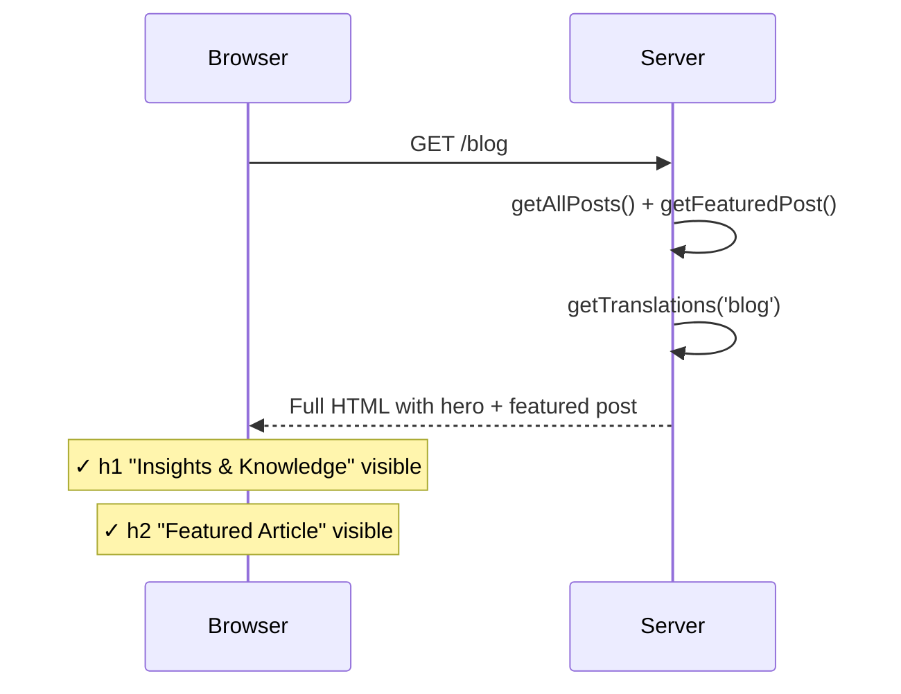
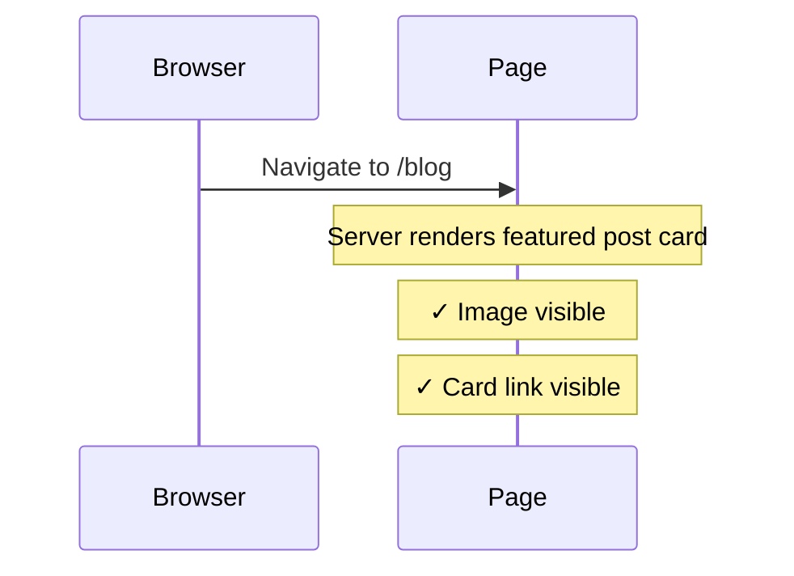
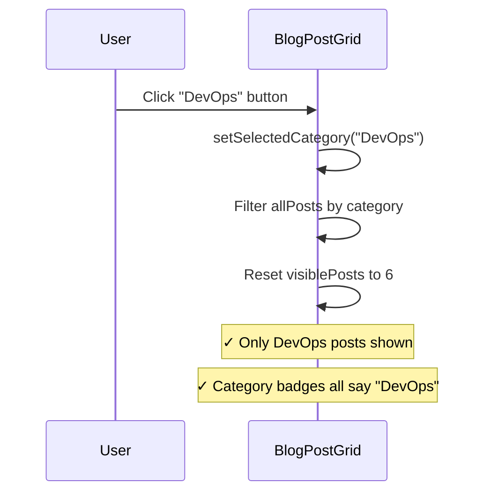
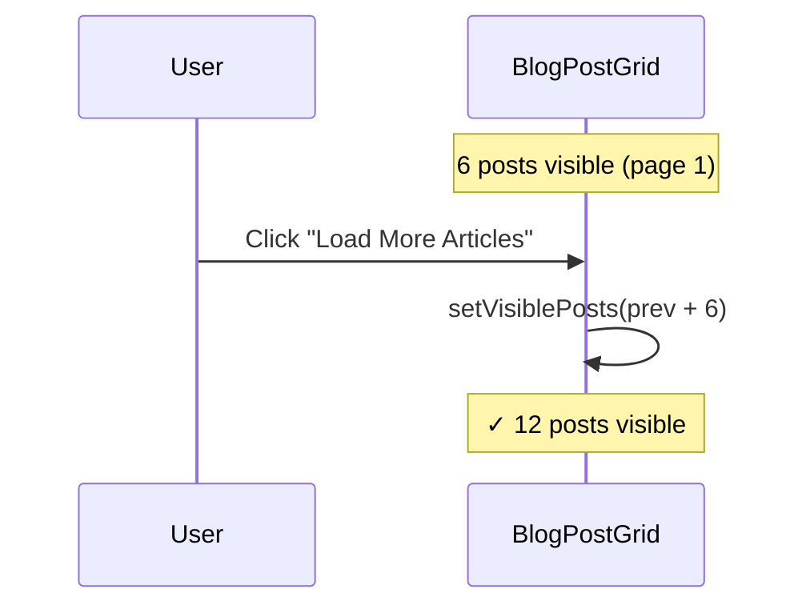
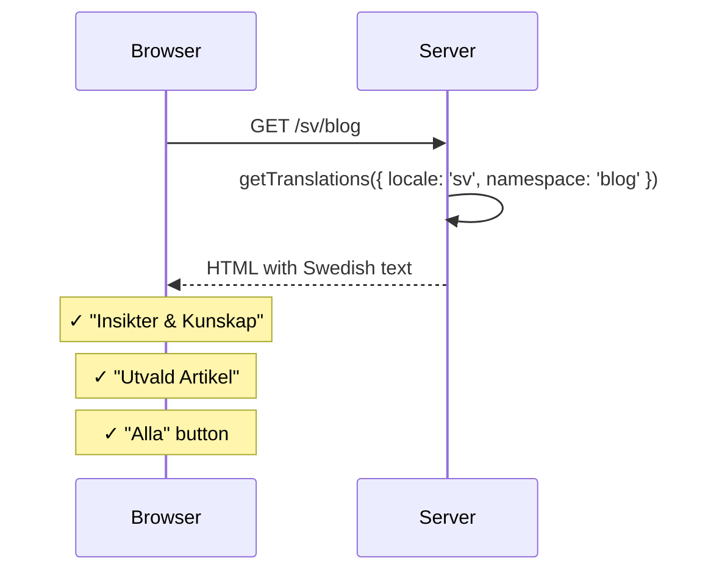

# Blog Listing Integration Tests

> Test flow documentation for [`blog-listing.spec.ts`](blog-listing.spec.ts)

These tests validate the blog listing page after its conversion from a client-rendered page (with loading spinner + API fetch) to a server-rendered page with interactive client islands. They verify SSR behavior, SEO metadata, category filtering, pagination, navigation, and locale support.

---

## Key Architecture

| Aspect             | Before (client)                    | After (server component)                     |
| ------------------ | ---------------------------------- | -------------------------------------------- |
| Data loading       | `useEffect` → `fetch('/api/blog')` | Direct `getAllPosts()` / `getFeaturedPost()` |
| Initial render     | `<LoadingScreen>` spinner          | Full HTML with content                       |
| Page `<title>`     | Root fallback only                 | `generateMetadata` with localized blog title |
| Interactive parts  | Entire page is `'use client'`      | `BlogPostGrid` client island only            |
| Category filtering | Client state in page component     | Client state in `BlogPostGrid` island        |

---

## Overview — Test Coverage Flow

```mermaid
flowchart TD
    A[Navigate to /blog] --> B{Content Visible?}
    B -- Yes --> C[✓ SSR verified — no loading spinner]
    B -- No --> X[✗ Regression to client rendering]
    C --> D{Page title correct?}
    D -- Yes --> E[✓ generateMetadata working]
    D -- No --> Y[✗ Metadata not exported]
    E --> F{Featured post visible?}
    F -- Yes --> G[Test featured card click → navigation]
    F -- No --> Z[✗ Featured post not rendered]
    G --> H[Category Filter Tests]
    H --> H1[Click category → posts filtered]
    H --> H2[Click All → posts reset]
    H1 --> I[Load More Tests]
    H2 --> I
    I --> I1[Load More visible with >6 posts]
    I --> I2[Click → more posts appear]
    I --> I3[All loaded → button hidden]
    I1 --> J[Locale Tests]
    I2 --> J
    I3 --> J
    J --> J1[/sv/blog shows Swedish text]
    J --> J2[Swedish metadata in title]
```

---

## Test Setup

No `beforeEach` hook is needed — each test navigates to the blog page independently. The page is server-rendered, so content is available immediately without clearing any client-side state.

---

## Test Cases

### Server-Side Rendering

#### should render blog page with hero content visible immediately

**Purpose:** Confirms the page is server-rendered with content in the initial HTML response, not hidden behind a loading spinner.

**Steps:**

1. Navigate to `/blog`.
2. Assert the hero `<h1>` contains "Insights" and "Knowledge".
3. Assert the "Featured Article" heading is visible.



#### should not show a loading spinner

**Purpose:** Validates the old `LoadingScreen` component is gone — content renders without a loading state.

**Steps:**

1. Navigate to `/blog`.
2. Assert "Loading blog posts" text is NOT visible.

#### should have correct page title (not root fallback)

**Purpose:** Verifies `generateMetadata` produces a blog-specific `<title>` tag.

**Steps:**

1. Navigate to `/blog`.
2. Read `document.title`.
3. Assert it contains "Insights", "Knowledge", and "Viscalyx".

#### should have meta description

**Purpose:** Confirms the page has a meta description for SEO.

**Steps:**

1. Navigate to `/blog`.
2. Read `<meta name="description">` content attribute.
3. Assert it is a non-empty string (>20 chars).

---

### Featured Post

#### should display the featured post card with metadata

**Purpose:** Verifies the featured post card renders with image and metadata.

**Steps:**

1. Navigate to `/blog`.
2. Locate the section containing the "Featured Article" heading.
3. Assert an image is visible within the featured section.
4. Assert the featured card link is visible.



#### should navigate to blog post when featured card is clicked

**Purpose:** Confirms the featured post card links to the correct blog post page.

**Steps:**

1. Navigate to `/blog`.
2. Click the featured post card link.
3. Assert the URL matches `/blog/{slug}`.

---

### Category Filter

#### should display category filter buttons

**Purpose:** Validates category filter buttons render for all unique categories.

**Steps:**

1. Navigate to `/blog`.
2. Assert "All" button is visible.
3. Assert more than one category button exists.

#### should filter posts when a category is clicked

**Purpose:** Confirms clicking a category shows only posts in that category.

**Steps:**

1. Navigate to `/blog`.
2. Count all visible `<article>` elements.
3. Click the "DevOps" category button.
4. Assert article count is ≥ 1 and ≤ initial count.
5. Assert all visible category badges show "DevOps".



#### should reset to all posts when "All" is clicked

**Purpose:** Verifies the "All" button resets the category filter.

**Steps:**

1. Navigate to `/blog`, note initial article count.
2. Click "DevOps" to filter.
3. Click "All" to reset.
4. Assert article count equals initial count.

---

### Load More Pagination

#### should show Load More button when posts exceed page size

**Purpose:** Confirms pagination is active with 16 posts (page size = 6).

**Steps:**

1. Navigate to `/blog`.
2. Assert "Load More" button is visible.
3. Assert exactly 6 articles are in the grid.

#### should reveal more posts when Load More is clicked

**Purpose:** Verifies clicking Load More increases visible posts.

**Steps:**

1. Navigate to `/blog`, count articles.
2. Click "Load More".
3. Assert article count increased.



#### should hide Load More when all posts are visible

**Purpose:** Confirms the button disappears once all posts are loaded.

**Steps:**

1. Navigate to `/blog`.
2. Click "Load More" repeatedly until it disappears.
3. Assert the button is no longer visible.

---

### Post Grid Cards

#### should render post cards with images, dates, and titles

**Purpose:** Validates individual post cards have the expected structure.

**Steps:**

1. Navigate to `/blog`.
2. Locate the first `<article>`.
3. Assert it has an image and a title (`<h3>`).

#### should navigate to blog post when card is clicked

**Purpose:** Confirms post card links navigate to the correct post page.

**Steps:**

1. Navigate to `/blog`.
2. Click the first post card's parent `<a>`.
3. Assert URL matches `/blog/{slug}`.

---

### Locale Switching

#### should render blog page in Swedish at /sv/blog

**Purpose:** Verifies the server component uses `getTranslations` correctly for Swedish.

**Steps:**

1. Navigate to `/sv/blog`.
2. Assert hero heading contains "Insikter" and "Kunskap".
3. Assert featured post heading is "Utvald Artikel".
4. Assert the "All" category button shows "Alla".



#### should have Swedish metadata at /sv/blog

**Purpose:** Confirms `generateMetadata` respects the locale parameter.

**Steps:**

1. Navigate to `/sv/blog`.
2. Read `document.title`.
3. Assert it contains "Insikter" and "Kunskap".
