# Blog Listing Spec Documentation

<!-- cspell:ignore Insikter Kunskap Utvald Artikel Alla -->

Companion documentation for
[`tests/integration/blog-listing.spec.ts`](./blog-listing.spec.ts).

This file maps each Playwright test to the exact locators, assertions, and
navigation flow used in the implementation so behavior stays aligned with the
spec.

## Overview Flow

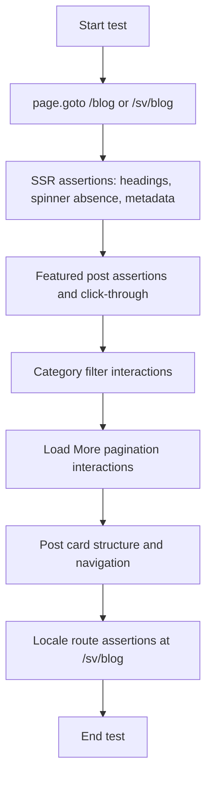
```mermaid
flowchart TD
    A[Start test] --> B[page.goto /blog or /sv/blog]
    B --> C[SSR assertions: headings, spinner absence, metadata]
    C --> D[Featured post assertions and click-through]
    D --> E[Category filter interactions]
    E --> F[Load More pagination interactions]
    F --> G[Post card structure and navigation]
    G --> H[Locale route assertions at /sv/blog]
    H --> I[End test]
```

## Test Setup

### Prerequisites

1. Playwright `page` fixture is provided per test by `@playwright/test`.
1. No auth bootstrap is required.
1. No explicit seed hook is used in the file; tests rely on available blog data.

### Constants

1. `POSTS_PER_PAGE = 6` is the expected initial card count ceiling for the grid.
1. `MAX_LOAD_MORE_CLICKS = 20` is the guard used when clicking until the button
   disappears.

### Helpers and Locator Patterns

1. `page.getByRole(...)` is used for semantic headings and buttons.
1. `page.locator(...)` is used for structural selection (`article`, `section`,
   metadata tags, card links).
1. `page.title()` validates localized metadata.
1. `page.waitForURL(/\/blog\/.+/)` validates navigation to a post slug page.

## Test Cases

### Server-Side Rendering › should render blog page with hero content visible immediately

Purpose: verify `/blog` is server-rendered with hero and featured heading visible
immediately.

Flow:

1. `page.goto('/blog')`.
1. Assert `h1` containing `Insights` is visible.
1. Assert `h1` containing `Knowledge` is visible.
1. Assert heading role `Featured Article` is visible.

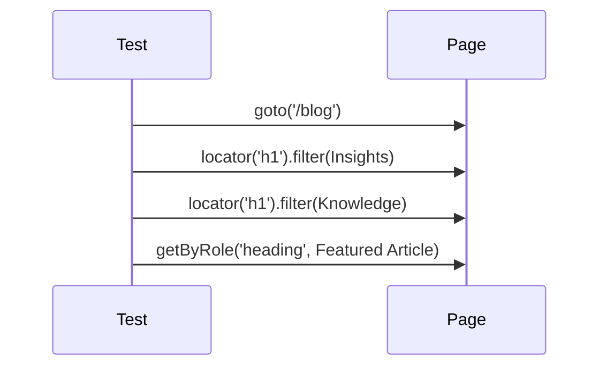
```mermaid
sequenceDiagram
    participant T as Test
    participant P as Page
    T->>P: goto('/blog')
    T->>P: locator('h1').filter(Insights)
    T->>P: locator('h1').filter(Knowledge)
    T->>P: getByRole('heading', Featured Article)
```

### Server-Side Rendering › should not show a loading spinner

Purpose: ensure legacy loading text is absent.

Flow:

1. `page.goto('/blog')`.
1. Assert `getByText('Loading blog posts')` is not visible.

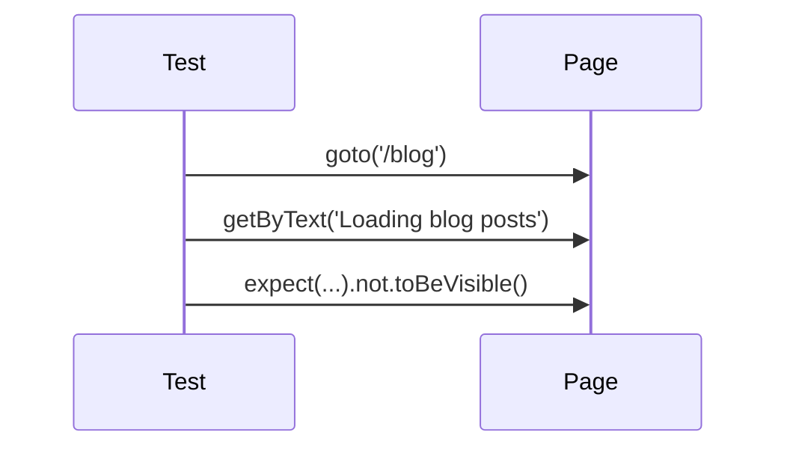
```mermaid
sequenceDiagram
    participant T as Test
    participant P as Page
    T->>P: goto('/blog')
    T->>P: getByText('Loading blog posts')
    T->>P: expect(...).not.toBeVisible()
```

### Server-Side Rendering › should have correct page title (not root fallback)

Purpose: validate blog-specific metadata title is rendered.

Flow:

1. `page.goto('/blog')`.
1. Read `title = await page.title()`.
1. Assert title contains `Insights`, `Knowledge`, `Viscalyx`.

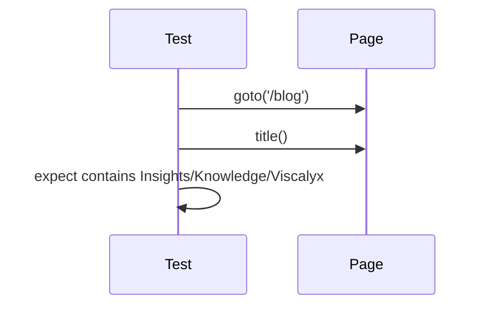
```mermaid
sequenceDiagram
    participant T as Test
    participant P as Page
    T->>P: goto('/blog')
    T->>P: title()
    T->>T: expect contains Insights/Knowledge/Viscalyx
```

### Server-Side Rendering › should have meta description

Purpose: confirm description metadata exists and is meaningful.

Flow:

1. `page.goto('/blog')`.
1. Read `meta[name="description"]` `content`.
1. Assert value is truthy.
1. Assert length > 20.

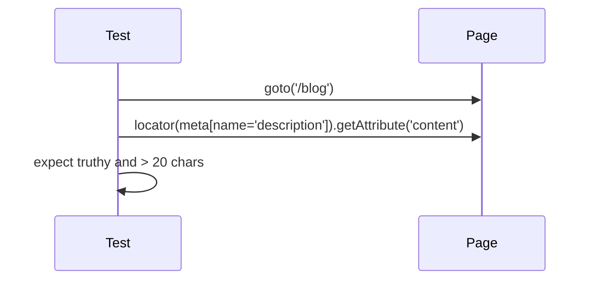
```mermaid
sequenceDiagram
    participant T as Test
    participant P as Page
    T->>P: goto('/blog')
    T->>P: locator(meta[name='description']).getAttribute('content')
    T->>T: expect truthy and > 20 chars
```

### Featured Post › should display the featured post card with metadata

Purpose: verify featured section and its primary card render.

Flow:

1. `page.goto('/blog')`.
1. Select `section` filtered by heading `Featured Article`.
1. Assert section visible.
1. Assert first image in section visible.
1. Assert first anchor in section visible.

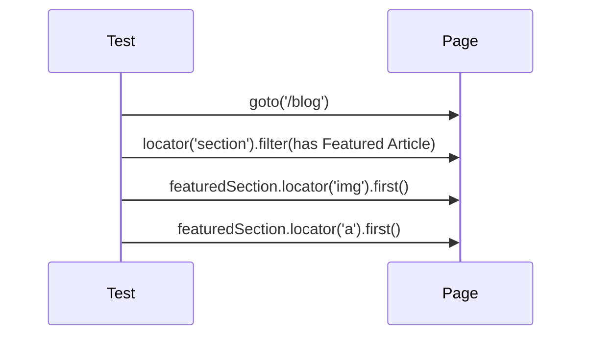
```mermaid
sequenceDiagram
    participant T as Test
    participant P as Page
    T->>P: goto('/blog')
    T->>P: locator('section').filter(has Featured Article)
    T->>P: featuredSection.locator('img').first()
    T->>P: featuredSection.locator('a').first()
```

### Featured Post › should navigate to blog post when featured card is clicked

Purpose: ensure featured card links to a slug route.

Flow:

1. `page.goto('/blog')`.
1. Build featured link locator from featured section.
1. Click first featured link.
1. `page.waitForURL(/\/blog\/.+/)`.
1. Assert `page.url()` matches `/blog/{slug}`.

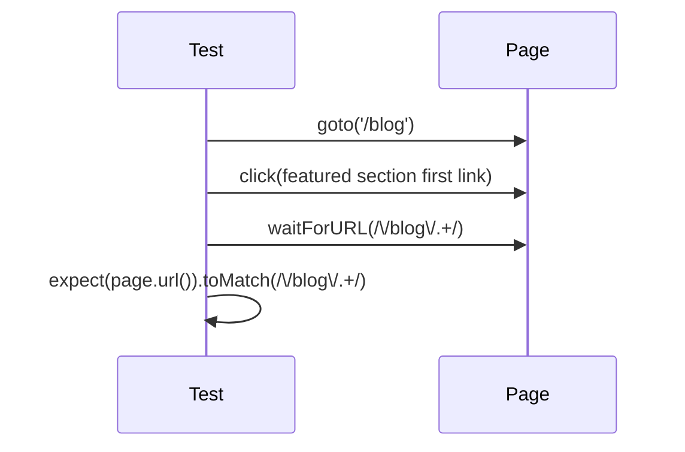
```mermaid
sequenceDiagram
    participant T as Test
    participant P as Page
    T->>P: goto('/blog')
    T->>P: click(featured section first link)
    T->>P: waitForURL(/\/blog\/.+/)
    T->>T: expect(page.url()).toMatch(/\/blog\/.+/)
```

### Category Filter › should display category filter buttons

Purpose: verify filter controls render including default and at least one real
category.

Flow:

1. `page.goto('/blog')`.
1. Assert `getByRole('button', { name: 'All' })` visible.
1. Locate `[data-testid="category-filter"]`.
1. Count child role `button` locators.
1. Assert count > 1.

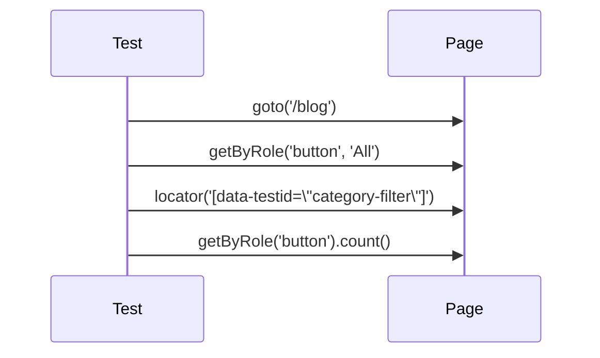
```mermaid
sequenceDiagram
    participant T as Test
    participant P as Page
    T->>P: goto('/blog')
    T->>P: getByRole('button', 'All')
    T->>P: locator('[data-testid=\"category-filter\"]')
    T->>P: getByRole('button').count()
```

### Category Filter › should filter posts when a category is clicked

Purpose: verify category interaction narrows visible posts and badges.

Flow:

1. `page.goto('/blog')`.
1. Count `locator('article')` as initial count.
1. Click role button `DevOps`.
1. Recount `article` elements.
1. Assert filtered count is > 0 and <= initial.
1. Iterate visible articles and assert each has exact text `DevOps`.

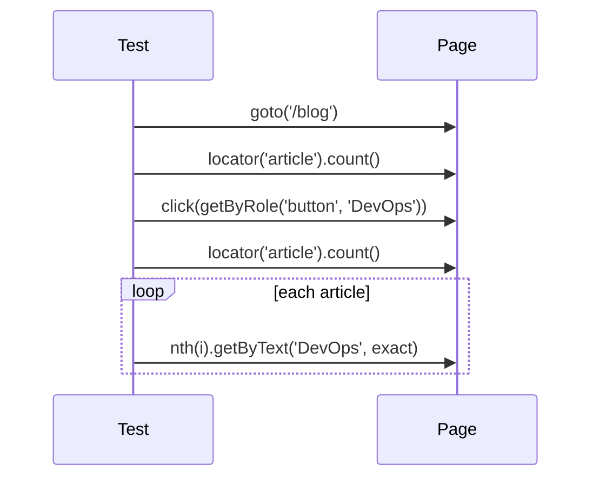
```mermaid
sequenceDiagram
    participant T as Test
    participant P as Page
    T->>P: goto('/blog')
    T->>P: locator('article').count()
    T->>P: click(getByRole('button', 'DevOps'))
    T->>P: locator('article').count()
    loop each article
      T->>P: nth(i).getByText('DevOps', exact)
    end
```

### Category Filter › should reset to all posts when "All" is clicked

Purpose: verify reset behavior returns full listing.

Flow:

1. `page.goto('/blog')`.
1. Record initial `article` count.
1. Click `DevOps`.
1. Click `All`.
1. Assert post count returns to initial value.

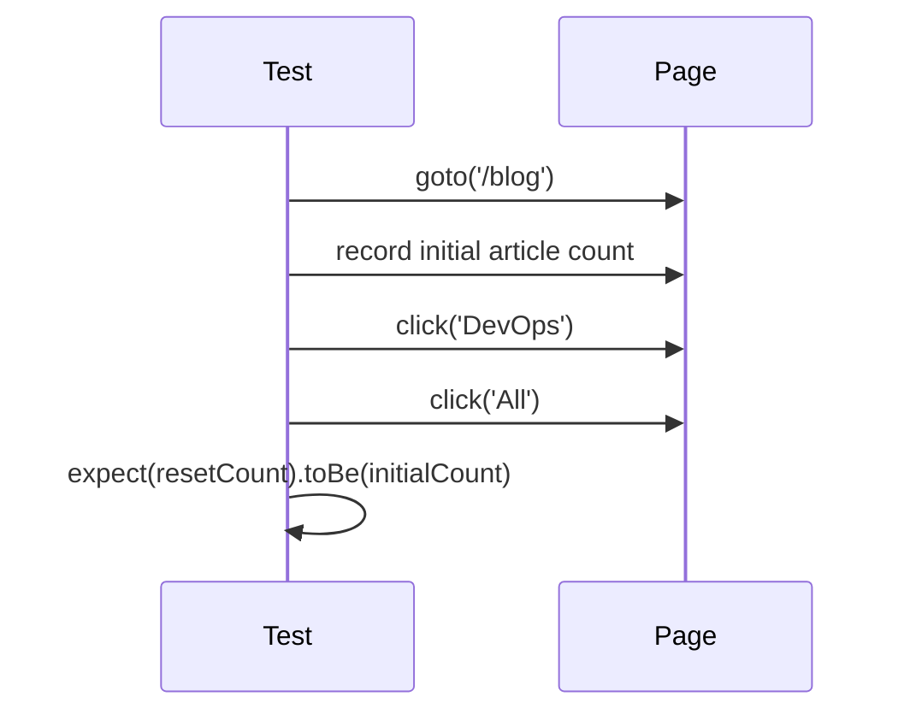
```mermaid
sequenceDiagram
    participant T as Test
    participant P as Page
    T->>P: goto('/blog')
    T->>P: record initial article count
    T->>P: click('DevOps')
    T->>P: click('All')
    T->>T: expect(resetCount).toBe(initialCount)
```

### Load More Pagination › should show Load More button when posts exceed page size

Purpose: verify first-page pagination state with configured page size.

Flow:

1. `page.goto('/blog')`.
1. Assert role button matching `/Load More/i` visible.
1. Count `article` cards.
1. Assert count > 0.
1. Assert count <= `POSTS_PER_PAGE` (`6`).

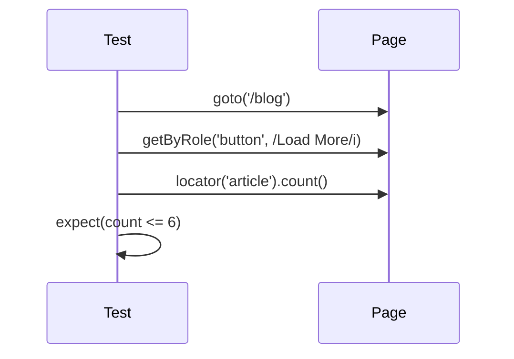
```mermaid
sequenceDiagram
    participant T as Test
    participant P as Page
    T->>P: goto('/blog')
    T->>P: getByRole('button', /Load More/i)
    T->>P: locator('article').count()
    T->>T: expect(count <= 6)
```

### Load More Pagination › should reveal more posts when Load More is clicked

Purpose: verify pagination growth after one click.

Flow:

1. `page.goto('/blog')`.
1. Capture initial `article` count.
1. Click role button `/Load More/i`.
1. Capture new count.
1. Assert new count > initial count.

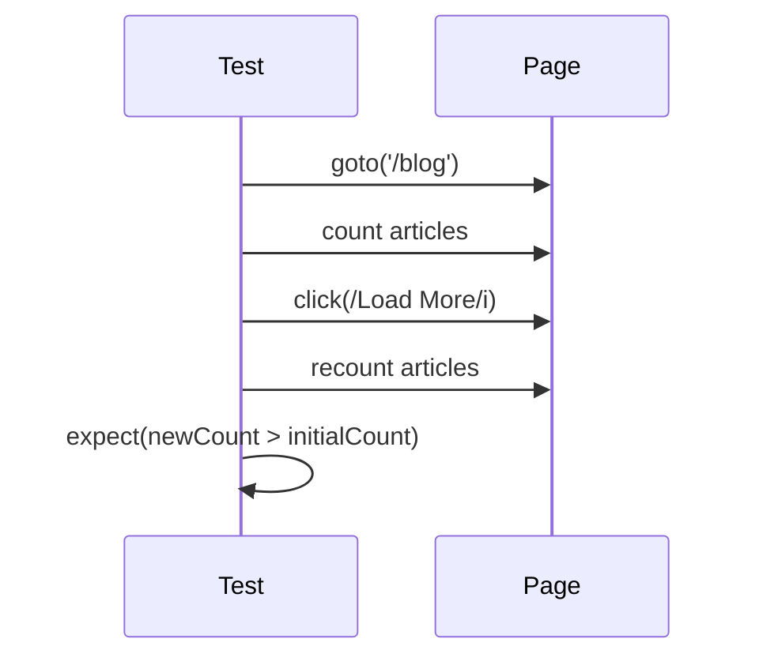
```mermaid
sequenceDiagram
    participant T as Test
    participant P as Page
    T->>P: goto('/blog')
    T->>P: count articles
    T->>P: click(/Load More/i)
    T->>P: recount articles
    T->>T: expect(newCount > initialCount)
```

### Load More Pagination › should hide Load More when all posts are visible

Purpose: verify termination state once every post is shown.

Flow:

1. `page.goto('/blog')`.
1. Repeat up to `MAX_LOAD_MORE_CLICKS` (`20`):
1. Resolve `loadMore = getByRole('button', /Load More/i)`.
1. Break if not visible; else click.
1. Assert `/Load More/i` button is not visible.

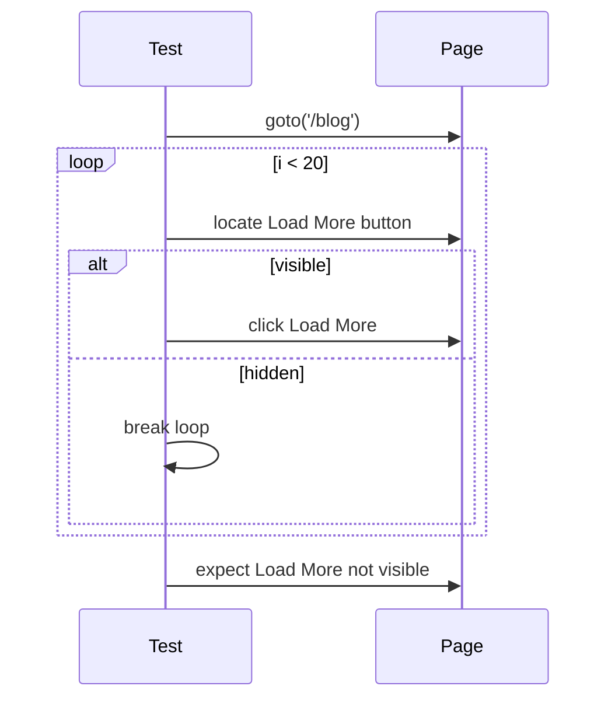
```mermaid
sequenceDiagram
    participant T as Test
    participant P as Page
    T->>P: goto('/blog')
    loop i < 20
      T->>P: locate Load More button
      alt visible
        T->>P: click Load More
      else hidden
        T->>T: break loop
      end
    end
    T->>P: expect Load More not visible
```

### Post Grid Cards › should render post cards with images, dates, and titles

Purpose: verify the structural integrity of article cards.

Flow:

1. `page.goto('/blog')`.
1. Select first `article`.
1. Assert first article visible.
1. Assert nested `img` visible.
1. Assert nested `h3` visible.

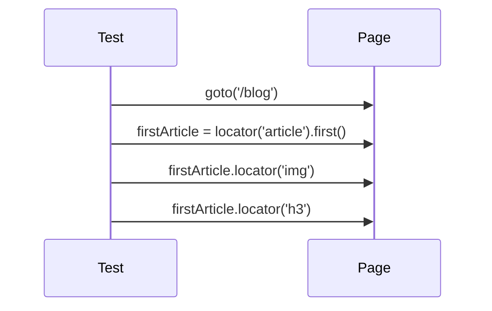
```mermaid
sequenceDiagram
    participant T as Test
    participant P as Page
    T->>P: goto('/blog')
    T->>P: firstArticle = locator('article').first()
    T->>P: firstArticle.locator('img')
    T->>P: firstArticle.locator('h3')
```

### Post Grid Cards › should navigate to blog post when card is clicked

Purpose: verify card click-through behavior to post detail pages.

Flow:

1. `page.goto('/blog')`.
1. Select first card link via `locator('a:has(article)').first()`.
1. Click selected link.
1. `page.waitForURL(/\/blog\/.+/)`.
1. Assert `page.url()` matches slug pattern.

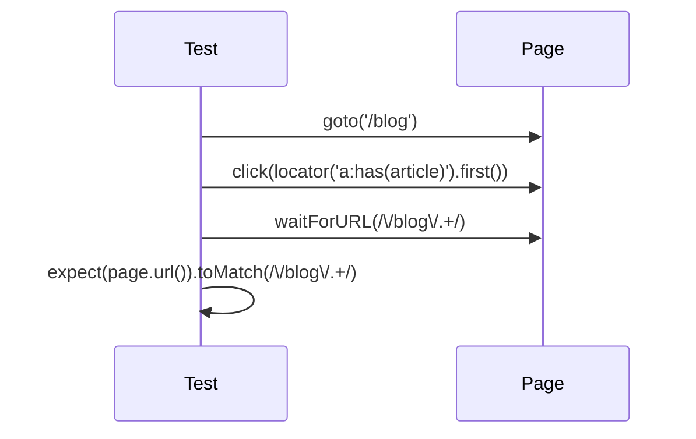
```mermaid
sequenceDiagram
    participant T as Test
    participant P as Page
    T->>P: goto('/blog')
    T->>P: click(locator('a:has(article)').first())
    T->>P: waitForURL(/\/blog\/.+/)
    T->>T: expect(page.url()).toMatch(/\/blog\/.+/)
```

### Locale Switching › should render blog page in Swedish at /sv/blog

Purpose: verify Swedish localized content appears on locale route.

Flow:

1. `page.goto('/sv/blog')`.
1. Assert Swedish `h1` text contains `Insikter`.
1. Assert Swedish `h1` text contains `Kunskap`.
1. Assert heading role `Utvald Artikel` visible.
1. Assert button role exact name `Alla` visible.

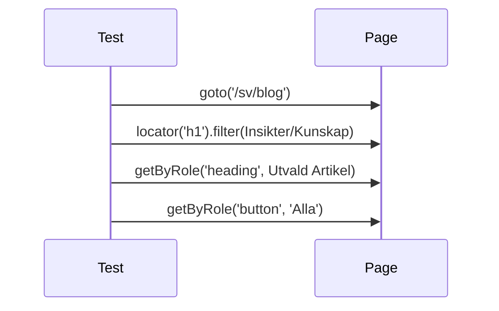
```mermaid
sequenceDiagram
    participant T as Test
    participant P as Page
    T->>P: goto('/sv/blog')
    T->>P: locator('h1').filter(Insikter/Kunskap)
    T->>P: getByRole('heading', Utvald Artikel)
    T->>P: getByRole('button', 'Alla')
```

### Locale Switching › should have Swedish metadata at /sv/blog

Purpose: verify localized metadata title for Swedish route.

Flow:

1. `page.goto('/sv/blog')`.
1. Read `title = await page.title()`.
1. Assert title contains `Insikter`.
1. Assert title contains `Kunskap`.

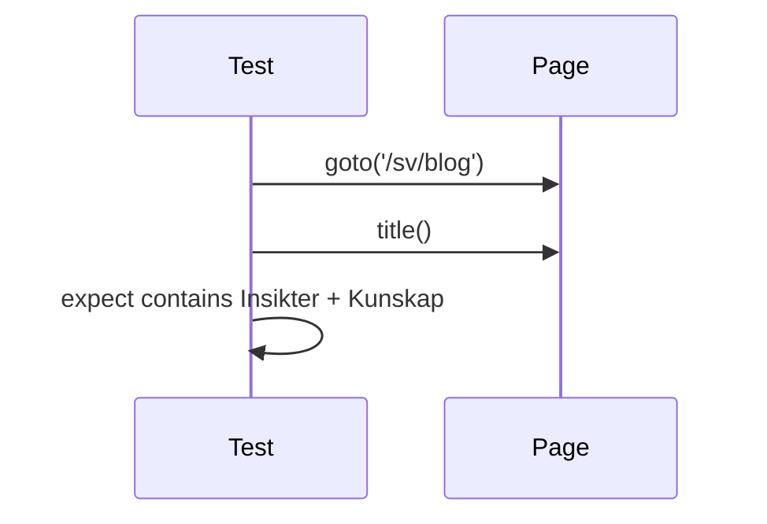
```mermaid
sequenceDiagram
    participant T as Test
    participant P as Page
    T->>P: goto('/sv/blog')
    T->>P: title()
    T->>T: expect contains Insikter + Kunskap
```
