# Cookie Consent Integration Tests

> Test flow documentation for [`cookie-consent.spec.ts`](cookie-consent.spec.ts)

This document describes each integration test case for the cookie consent banner, including clear text flows and Mermaid diagrams illustrating user interactions, DOM state changes, and storage operations.

---

## Consent Data Model

| Property    | Type     | Description                                      |
| ----------- | -------- | ------------------------------------------------ |
| `version`   | `string` | Schema version, currently `"1.0"`                |
| `settings`  | `object` | Per-category boolean flags                       |
| `timestamp` | `string` | ISO 8601 date of when the user made their choice |

**localStorage key:** `viscalyx.se-cookie-consent`

**Settings shape:**

```jsonc
{
  "strictly-necessary": true,
  "analytics": true, // or false
  "preferences": true, // or false
}
```

`strictly-necessary` is always `true` and cannot be disabled by the user.

---

## Overview — Full Consent Flow

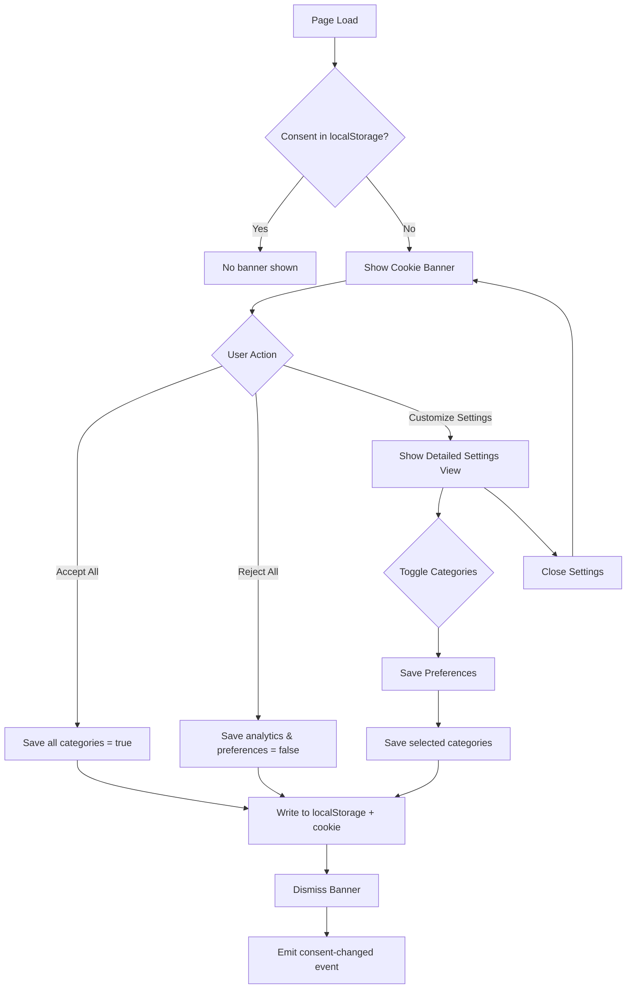

---

## Test Setup

### `beforeEach` Hook

Every test starts with a clean slate:

1. Navigate to `/` to establish a page context.
2. Clear `localStorage` key `viscalyx.se-cookie-consent`.
3. Clear all browser cookies.
4. Reload the page so the banner appears fresh.

### `waitForBanner` Helper

Waits for the banner to be ready for interaction:

1. Locate the element matching `[role="dialog"][aria-modal="true"]`.
2. Assert it is visible.
3. Wait **400 ms** for the Framer Motion entrance animation (`y: 100 → 0`, 300 ms, easeOut) to settle.
4. Return the banner locator for chaining.

---

## Test Cases

### 1. Should display cookie consent banner on main page

**Purpose:** Verify the banner appears on first visit with all expected UI elements.

**Flow:**

1. Navigate to `/`.
2. Wait for the banner to appear and animate in.
3. Assert the banner contains an `<h2>` heading ("We Use Cookies").
4. Assert "Accept All" button is visible.
5. Assert "Reject All" button is visible.
6. Assert "Customize Settings" text is visible.

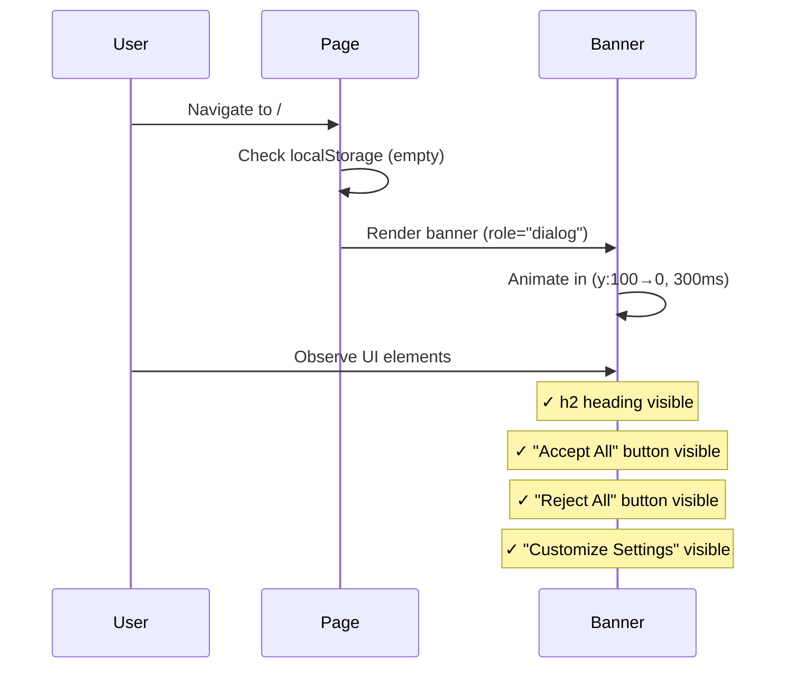

---

### 2. Should accept all cookies when clicking "Accept All"

**Purpose:** Confirm that accepting all cookies hides the banner and stores the correct consent data with all categories enabled.

**Flow:**

1. Navigate to `/`.
2. Wait for the banner.
3. Click "Accept All".
4. Assert the banner is no longer visible.
5. Read `localStorage` key `viscalyx.se-cookie-consent`.
6. Assert `settings` has `strictly-necessary: true`, `analytics: true`, `preferences: true`.
7. Assert `timestamp` is present.
8. Assert `version` is `"1.0"`.

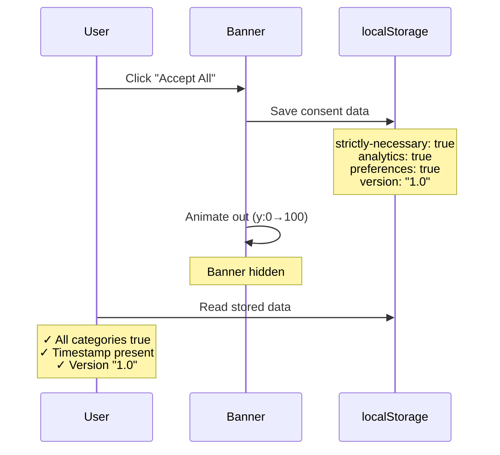

---

### 3. Should reject all cookies when clicking "Reject All"

**Purpose:** Confirm that rejecting all cookies hides the banner and stores consent with only strictly-necessary enabled.

**Flow:**

1. Navigate to `/`.
2. Wait for the banner.
3. Click "Reject All".
4. Assert the banner is no longer visible.
5. Read `localStorage` key `viscalyx.se-cookie-consent`.
6. Assert `settings` has `strictly-necessary: true`, `analytics: false`, `preferences: false`.
7. Assert `timestamp` is present.
8. Assert `version` is `"1.0"`.

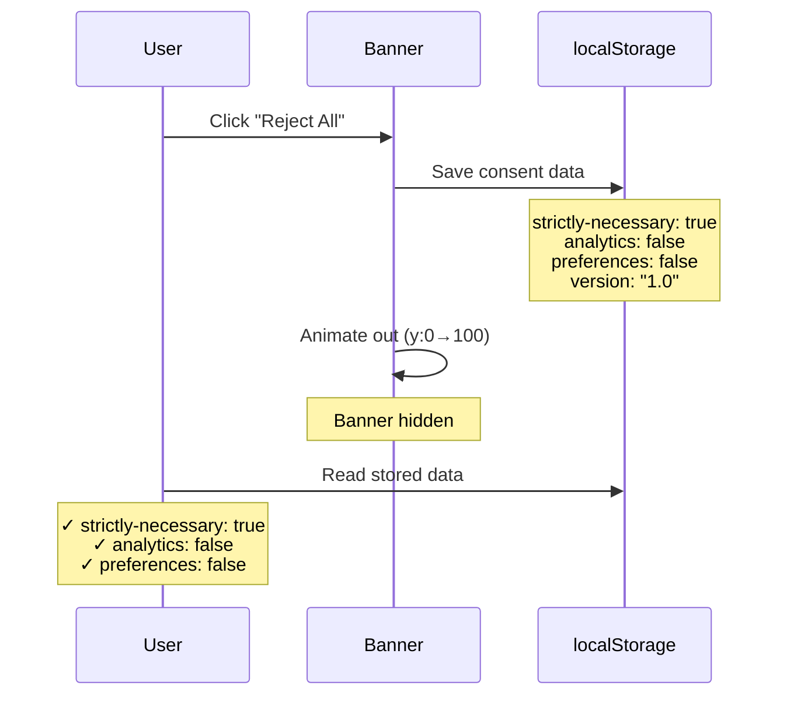

---

### 4. Should open detailed cookie settings when clicking "Customize Settings"

**Purpose:** Verify the detailed settings panel opens with the correct toggle states and UI elements.

**Flow:**

1. Navigate to `/`.
2. Wait for the banner.
3. Click "Customize Settings" text (not the link, to avoid aria-label collision).
4. Assert "Cookie Settings" heading (`<h2>`) is visible.
5. Assert three toggle checkboxes exist in the DOM:
   - `#toggle-strictly-necessary` — checked and **disabled** (cannot be changed).
   - `#toggle-analytics` — unchecked and **enabled**.
   - `#toggle-preferences` — unchecked and **enabled**.
6. Assert "Save Preferences" button is visible.

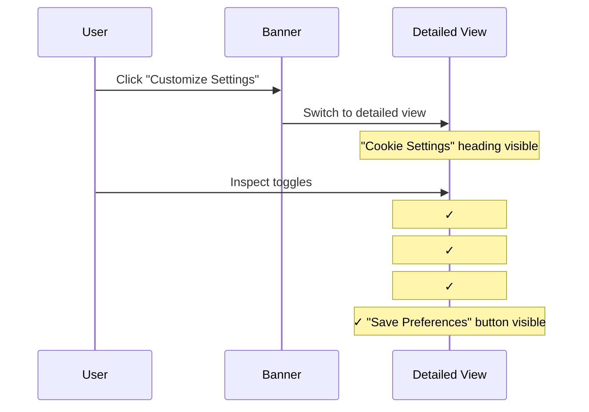

---

### 5. Should allow toggling individual cookie categories

**Purpose:** Verify users can toggle categories on/off individually and that the saved data reflects the final toggle states.

**Flow:**

1. Navigate to `/`.
2. Wait for the banner.
3. Click "Customize Settings" to open detailed view.
4. Verify initial state: only `strictly-necessary` is checked.
5. Click the label wrapping `#toggle-analytics` → analytics becomes **checked**.
6. Click the label wrapping `#toggle-preferences` → preferences becomes **checked**.
7. Click the label wrapping `#toggle-analytics` again → analytics becomes **unchecked**.
8. Click "Save Preferences".
9. Assert the banner is hidden.
10. Read `localStorage` and verify:
    - `strictly-necessary: true`
    - `analytics: false` (toggled back off)
    - `preferences: true` (left on)

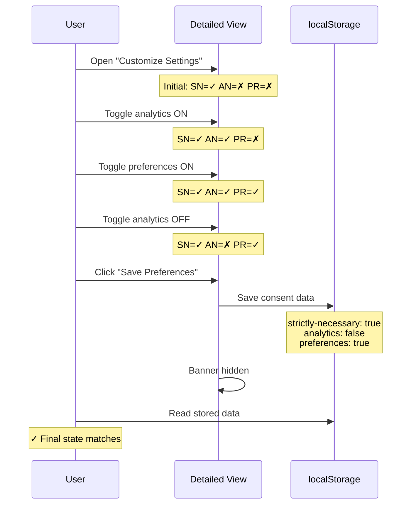

The toggle decision flow:

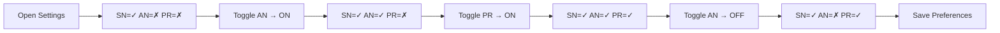

---

### 6. Should persist cookie consent choice across page reloads

**Purpose:** Verify that once the user makes a consent choice, the banner stays hidden across page reloads and navigation.

**Flow:**

1. Navigate to `/`.
2. Wait for the banner.
3. Click "Accept All" → banner hides.
4. Reload the page.
5. Assert the banner dialog is **not** visible (consent persisted).
6. Navigate to `/privacy`.
7. Navigate back to `/`.
8. Assert the banner dialog is still **not** visible.

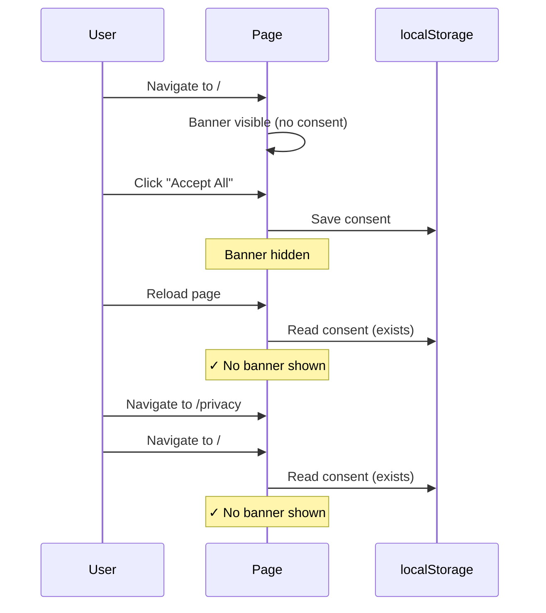

Persistence decision flow:

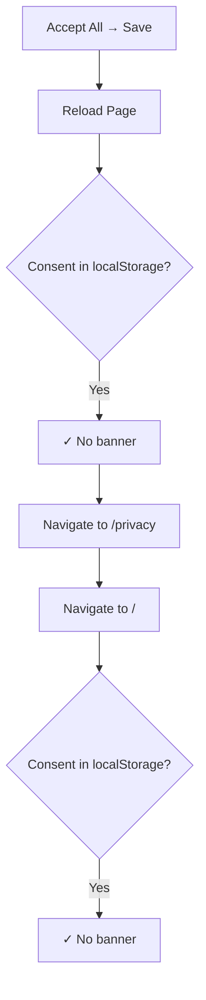

---

### 7. Should close detailed settings and return to simple banner view

**Purpose:** Verify that the Close button in the detailed settings view returns the user to the simple banner without dismissing it entirely.

**Flow:**

1. Navigate to `/`.
2. Wait for the banner.
3. Click "Customize Settings" to open detailed view.
4. Assert "Cookie Settings" heading is visible.
5. Click the "Close" button (`aria-label="Close"`).
6. Assert "Cookie Settings" heading is **no longer** visible.
7. Assert "Accept All" button is visible (back to simple view).

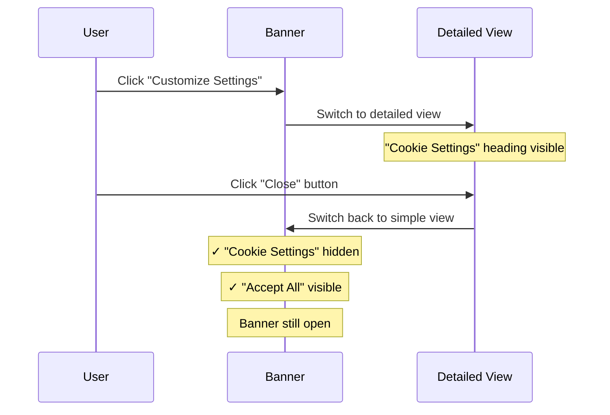

---

### 8. Should handle keyboard navigation and focus management

**Purpose:** Verify the banner supports keyboard navigation with a focus trap and that Escape focuses the Reject All button (cancel action).

**Flow:**

1. Navigate to `/`.
2. Wait for the banner.
3. Press `Tab` to move focus to the first interactive element.
4. Press `Escape`.
5. Assert the "Reject All" button is still visible (Escape focuses it, does not dismiss the banner).
6. Assert the "Accept All" button is still visible.

**Accessibility features under test:**

- **Focus trap:** Tab/Shift+Tab cycles through focusable elements within the banner.
- **Escape key:** Focuses the "Reject All" button, treating Escape as a "deny/cancel" action.
- **Auto-focus:** On banner show, focus moves to "Accept All" after 100 ms.

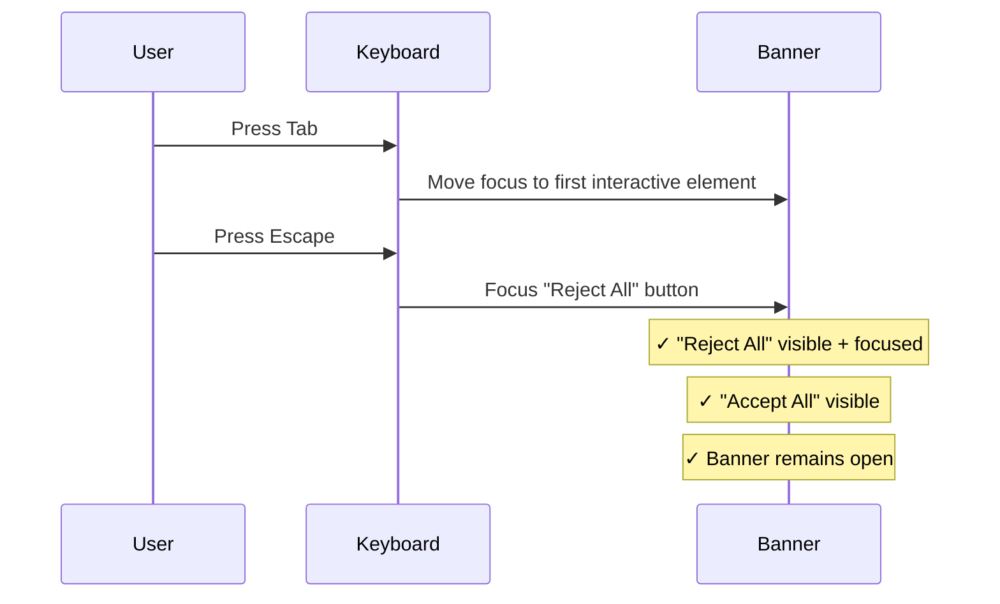
