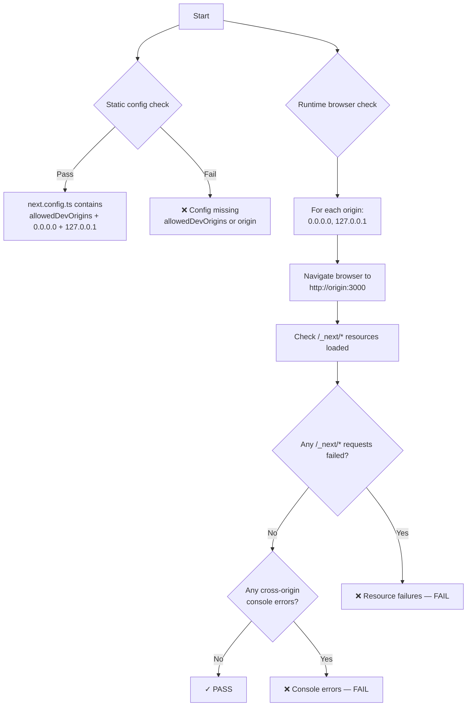
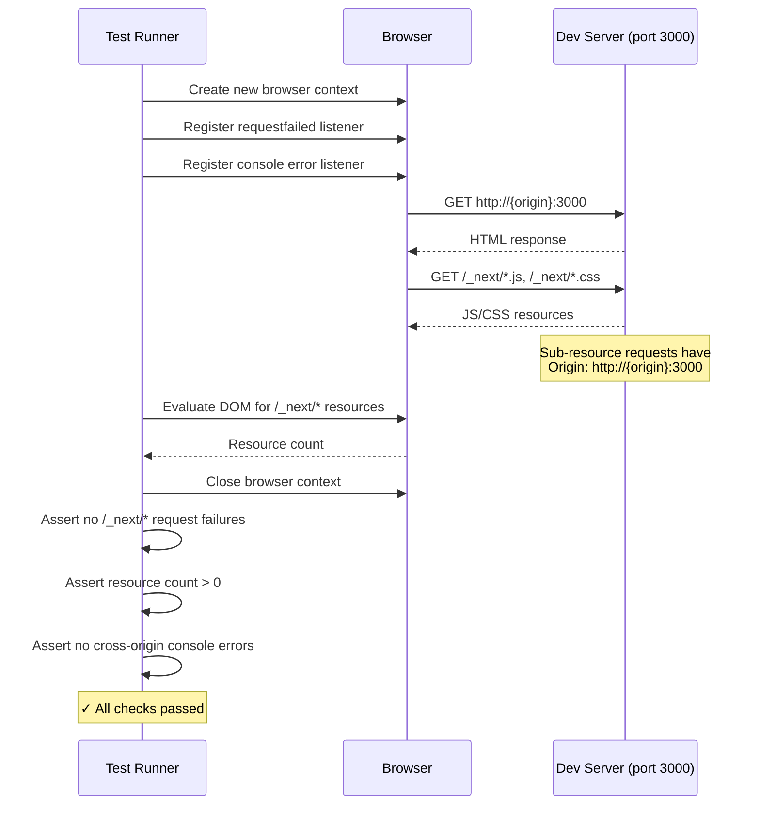
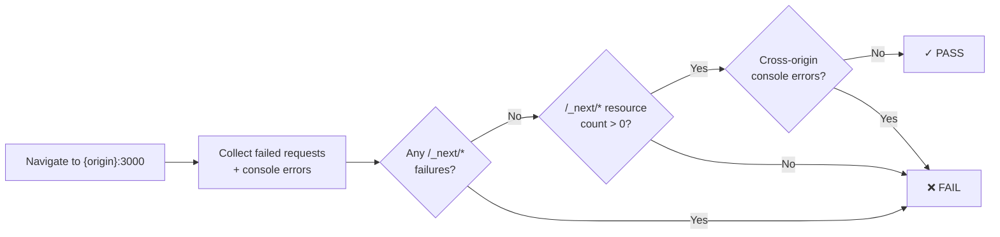
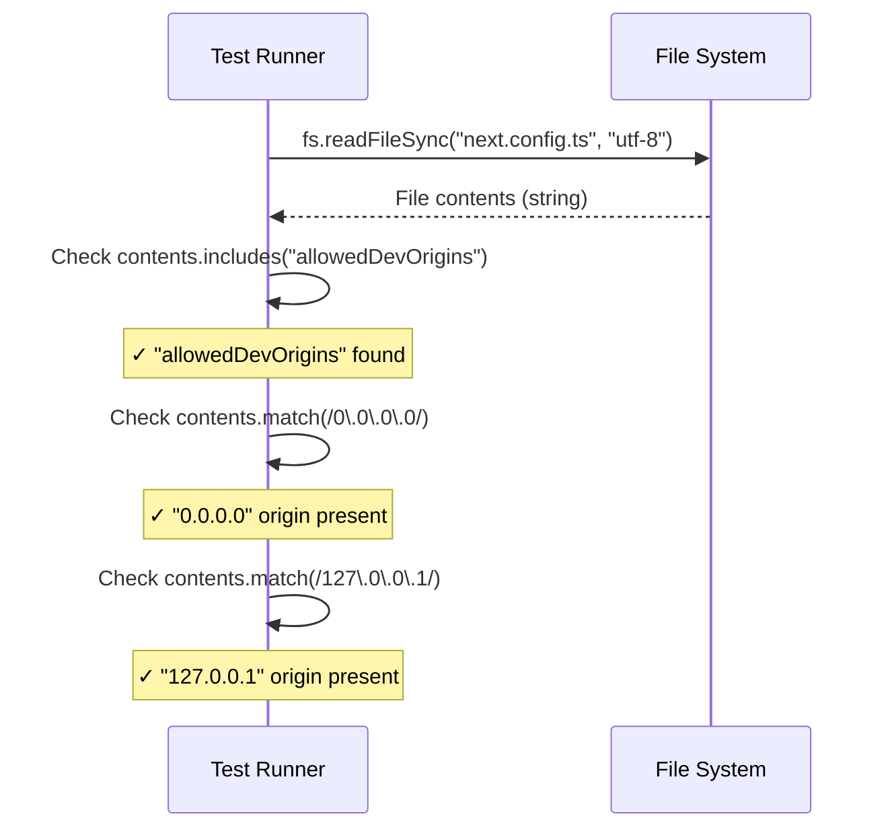
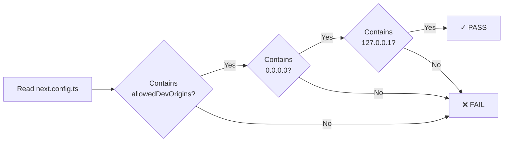

# Cross-Origin Warning Integration Tests

> Test flow documentation for [`cross-origin-warning.spec.ts`](cross-origin-warning.spec.ts)

This test suite verifies that the Next.js dev server does not emit cross-origin
warnings when the application is accessed via `0.0.0.0` or `127.0.0.1` (common
in devcontainer and Docker setups). It validates the fix for [GitHub issue #128](https://github.com/viscalyx/viscalyx.se/issues/128), which requires
`allowedDevOrigins: ['0.0.0.0', '127.0.0.1']` in `next.config.ts`.

---

## Background

When running Next.js inside a devcontainer, the dev server is often accessed via
`http://0.0.0.0:<port>`. Starting with Next.js 16, this triggers a server-side
warning:

> ⚠ Cross origin request detected from 0.0.0.0 to /\_next/\* resource.

The warning is only visible in the server's stdout/stderr — not in the browser
console — making it easy to miss. The fix is a single config line:

<!-- markdownlint-disable MD013 -->
```ts
allowedDevOrigins: ['0.0.0.0', '127.0.0.1']
```
<!-- markdownlint-enable MD013 -->

---

## Overview — Test Decision Flow

<!-- markdownlint-disable MD013 -->

<!-- markdownlint-enable MD013 -->

---

## Test Setup

### No shared `beforeEach`

This suite has **no shared setup hook**. Each test is self-contained:

- **Tests 1–2** (generated via `for` loop over `['0.0.0.0', '127.0.0.1']`)
  reuse the Playwright-managed dev server (port 3000) and verify resources load
  correctly from the browser side.
- **Test 3** reads the config file directly via `fs.readFileSync`.

### Design Decision: Reuse the Playwright-Managed Server

Earlier versions of these tests spawned dedicated `next dev` instances on
separate ports. This caused:

- `.next` build cache conflicts (two Next.js servers sharing the same project
  directory)
- Resource starvation in containers (multiple compilers running simultaneously)
- Flaky timeouts and port conflicts affecting other test files

The current approach reuses the Playwright-managed dev server on port 3000 and
validates from the **browser side** — checking that `/_next/*` resources load
successfully and no cross-origin errors appear in the console. The static config
test provides an additional fast guard.

### Constants

<!-- markdownlint-disable MD013 -->
| Name       | Value  | Description                                                                     |
| ---------- | ------ | ------------------------------------------------------------------------------- |
| `DEV_PORT` | `3000` | The Playwright-managed dev server port (from `playwright.config.ts` `baseURL`). |
<!-- markdownlint-enable MD013 -->

---

## Test Cases

<!-- markdownlint-disable MD013 -->
### 1–2. Should load page without cross-origin resource errors when accessing via {origin}
<!-- markdownlint-enable MD013 -->

These tests are generated by a `for...of` loop over `['0.0.0.0', '127.0.0.1']`,
producing one test per origin.

**Purpose:** Verify that navigating to the dev server via `http://{origin}:3000`
loads all `/_next/*` resources (JS, CSS) without network failures or
cross-origin console errors. If `allowedDevOrigins` were missing, the browser
would encounter blocked resources.

**Step-by-Step Flow:**

1. Create a new browser context.
2. Register listeners for failed network requests and console errors.
3. Navigate to `http://{origin}:3000` with `waitUntil: 'load'`.
4. Count `/_next/*` resources in the DOM (`<script>` and `<link>` elements).
5. Close the browser context.
6. Assert no `/_next/*` requests failed.
7. Assert at least one `/_next/*` resource was loaded.
8. Assert no cross-origin related console errors.

<!-- markdownlint-disable MD013 -->

<!-- markdownlint-enable MD013 -->

#### Resource validation flowchart

<!-- markdownlint-disable MD013 -->

<!-- markdownlint-enable MD013 -->

---

### 3. next.config.ts should have allowedDevOrigins configured

**Purpose:** Static validation that the `next.config.ts` file contains the
`allowedDevOrigins` key with both `0.0.0.0` and `127.0.0.1` entries. This acts
as a fast guard-rail — if someone removes a config entry, this test fails
instantly without needing to boot a dev server.

**Step-by-Step Flow:**

1. Read the contents of `next.config.ts` using
   `fs.readFileSync('next.config.ts', 'utf-8')`.
2. Assert the file content contains the string `"allowedDevOrigins"`.
3. Assert the file content matches the regex `/0\.0\.0\.0/`.
4. Assert the file content matches the regex `/127\.0\.0\.1/`.

<!-- markdownlint-disable MD013 -->

<!-- markdownlint-enable MD013 -->

#### Config validation flowchart

<!-- markdownlint-disable MD013 -->

<!-- markdownlint-enable MD013 -->
