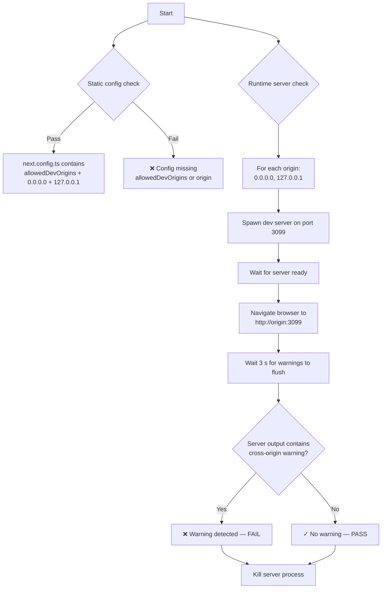
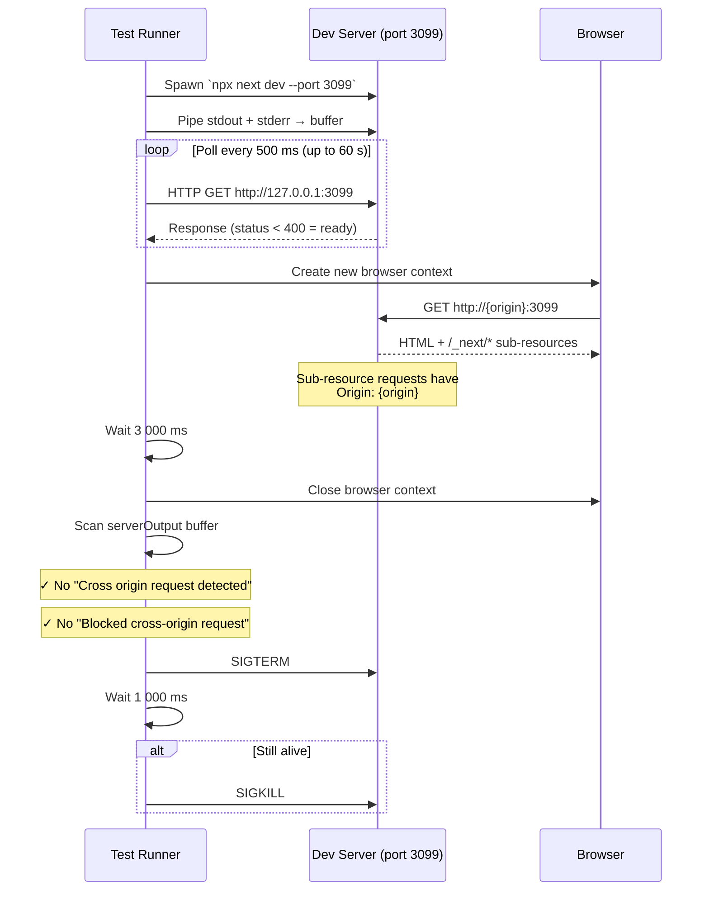
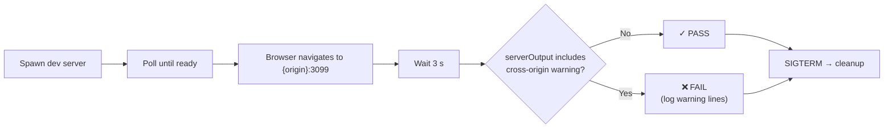
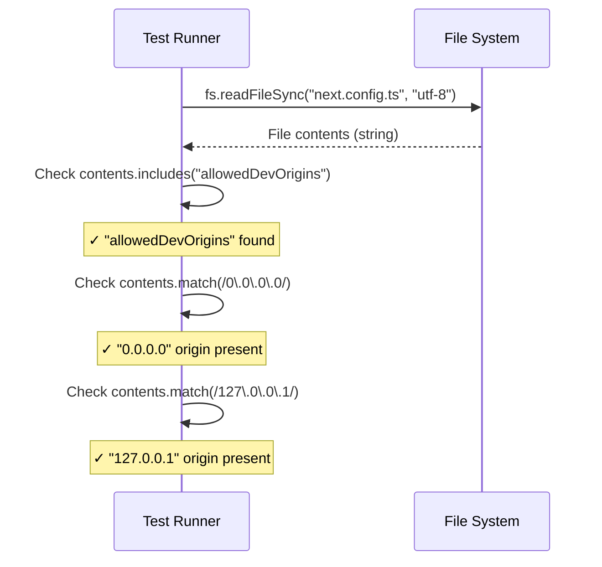
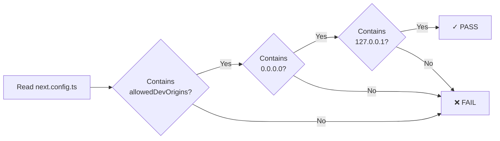

# Cross-Origin Warning Integration Tests

> Test flow documentation for [`cross-origin-warning.spec.ts`](cross-origin-warning.spec.ts)

This test suite verifies that the Next.js dev server does not emit cross-origin warnings when the application is accessed via `0.0.0.0` or `127.0.0.1` (common in devcontainer and Docker setups). It validates the fix for [GitHub issue #128](https://github.com/viscalyx/viscalyx.se/issues/128), which requires `allowedDevOrigins: ['0.0.0.0', '127.0.0.1']` in `next.config.ts`.

---

## Background

When running Next.js inside a devcontainer, the dev server is often accessed via `http://0.0.0.0:<port>`. Starting with Next.js 16, this triggers a server-side warning:

> ⚠ Cross origin request detected from 0.0.0.0 to /\_next/\* resource.

The warning is only visible in the server's stdout/stderr — not in the browser console — making it easy to miss. The fix is a single config line:

```ts
allowedDevOrigins: ['0.0.0.0', '127.0.0.1']
```

---

## Overview — Test Decision Flow



---

## Test Setup

### No shared `beforeEach`

Unlike the cookie consent tests, this suite has **no shared setup hook**. Each test is self-contained:

- **Tests 1–2** (generated via `for` loop over `['0.0.0.0', '127.0.0.1']`) each spawn and tear down their own dedicated dev server.
- **Test 3** reads the config file directly via `fs.readFileSync`.

### Constants

| Name                | Value  | Description                                                                                                                                                                              |
| ------------------- | ------ | ---------------------------------------------------------------------------------------------------------------------------------------------------------------------------------------- |
| `CROSS_ORIGIN_PORT` | `3099` | Dedicated port for the test's dev server instance. If CI flakiness occurs due to port conflicts, consider detecting a free port dynamically (e.g., via `get-port` or binding to port 0). |

### Helper: `waitForServer(url, timeoutMs)`

Polls a URL with `http.get` until a response with status `< 400` is received:

- **Default timeout:** 60 000 ms
- **Poll interval:** 500 ms
- Calls `res.resume()` on each response to drain the body and free the socket, preventing connection buildup during repeated polling.
- Rejects with an error if the server never becomes ready.

---

## Test Cases

### 1–2. Should not produce cross-origin warning in server output when accessing via {origin}

These tests are generated by a `for...of` loop over `['0.0.0.0', '127.0.0.1']`, producing one test per origin.

**Purpose:** Verify that navigating to the dev server via `http://{origin}:3099` does not produce any `Cross origin request detected` or `Blocked cross-origin request` messages in the server's stdout/stderr. This is the runtime proof that `allowedDevOrigins` is working for each origin.

**Timeout:** 90 000 ms (accounts for cold-start compilation on first request).

**Step-by-Step Flow:**

1. Spawn a Next.js dev server (`npx next dev --port 3099`) with `stdio: ['ignore', 'pipe', 'pipe']` to capture all output.
2. Accumulate stdout and stderr into a `serverOutput` string buffer.
3. Wait for the server to respond at `http://127.0.0.1:3099` (up to 60 s).
4. Open a new browser context and navigate to `http://{origin}:3099` with `waitUntil: 'load'`.
5. Wait 3 000 ms for the server to flush any deferred warnings.
6. Close the browser context.
7. Search `serverOutput` for `"Cross origin request detected"` or `"Blocked cross-origin request"`.
8. Assert that **neither** string is found.
9. _(Finally block)_ Send `SIGTERM` to the server process; if still alive after 1 s, send `SIGKILL`.



#### Server lifecycle flowchart



---

### 3. next.config.ts should have allowedDevOrigins configured

**Purpose:** Static validation that the `next.config.ts` file contains the `allowedDevOrigins` key with both `0.0.0.0` and `127.0.0.1` entries. This acts as a fast guard-rail — if someone removes a config entry, this test fails instantly without needing to boot a dev server.

**Step-by-Step Flow:**

1. Read the contents of `next.config.ts` using `fs.readFileSync('next.config.ts', 'utf-8')`.
2. Assert the file content contains the string `"allowedDevOrigins"`.
3. Assert the file content matches the regex `/0\.0\.0\.0/`.
4. Assert the file content matches the regex `/127\.0\.0\.1/`.



#### Config validation flowchart


