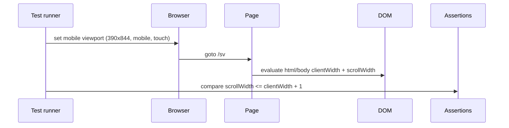
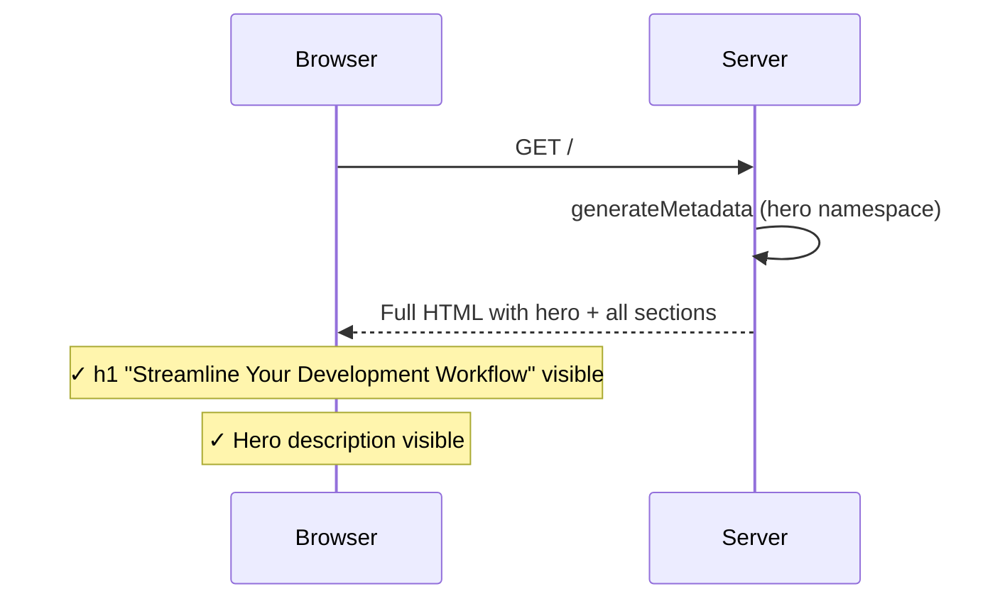
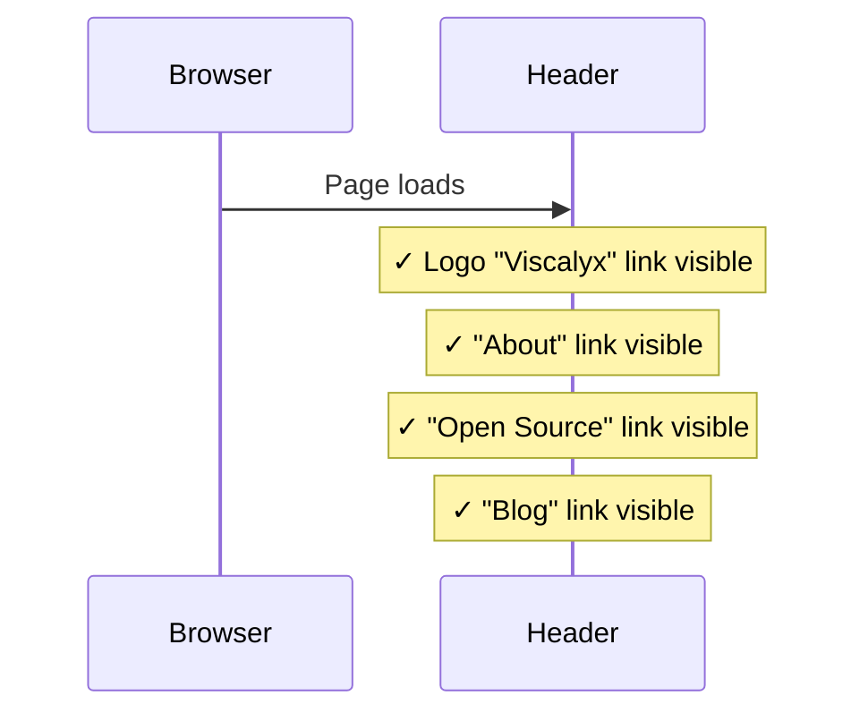
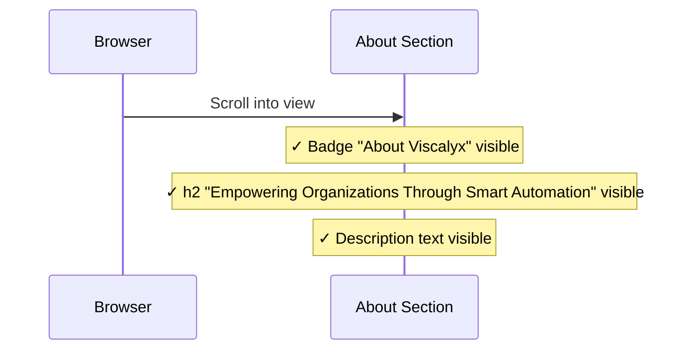
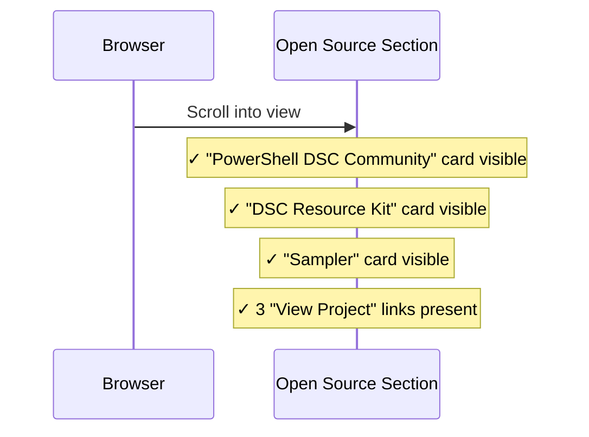
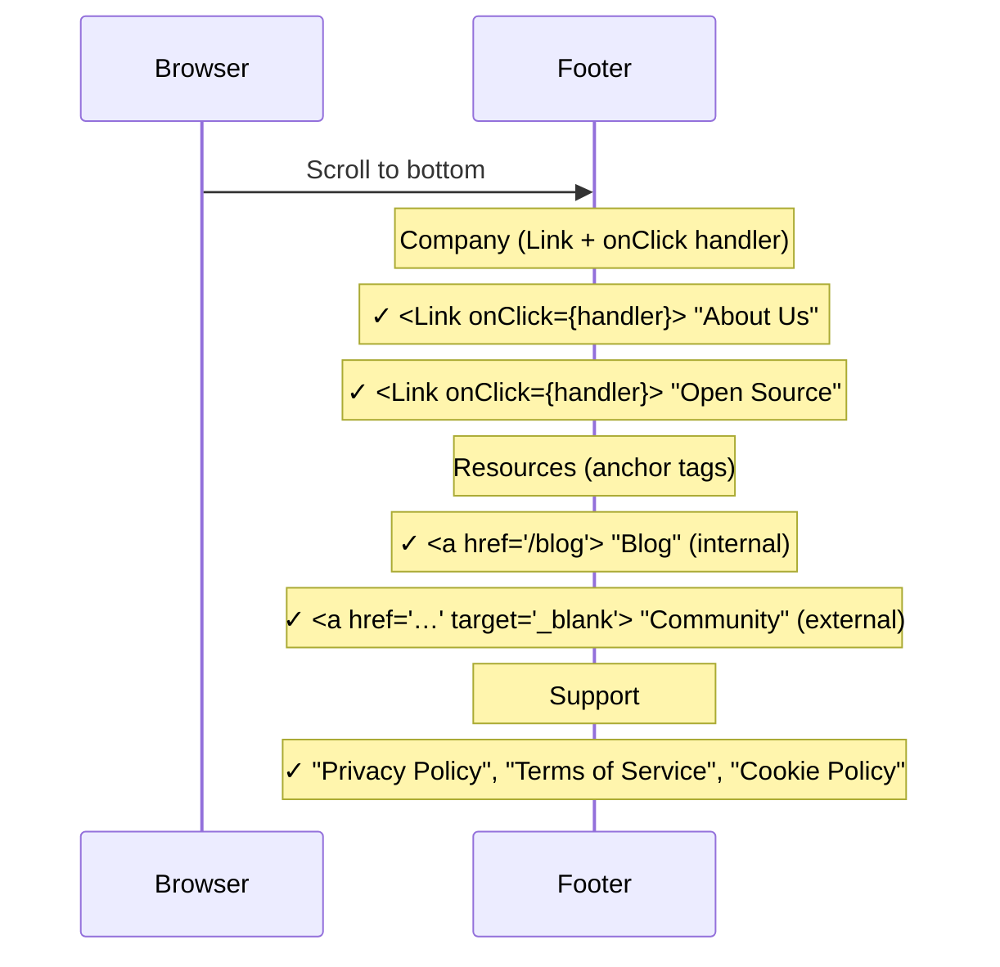
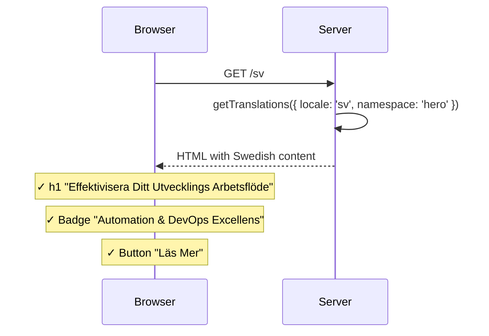

# Homepage Integration Tests

> Test flow documentation for [`homepage.spec.ts`](homepage.spec.ts)

These tests validate the homepage. They verify SSR behavior, SEO metadata,
section content, navigation, and locale support.

---

## Key Architecture

<!-- markdownlint-disable MD013 -->
| Aspect            | Before (client)                         | After (server component)                        |
| ----------------- | --------------------------------------- | ----------------------------------------------- |
| Page directive    | `'use client'`                          | Server component (no directive)                 |
| Fade-in animation | `motion.main` (Framer Motion)           | CSS `animate-fade-in` class                     |
| Page `<title>`    | Root fallback only (English hardcoded)  | `generateMetadata` with localized hero title    |
| Initial render    | Empty shell until JS loads and hydrates | Full HTML with all section content              |
| Child components  | All `'use client'` (unchanged)          | All `'use client'` (unchanged — client islands) |
<!-- markdownlint-enable MD013 -->

---

## Overview — Test Coverage Flow

<!-- markdownlint-disable MD013 -->
```mermaid
flowchart TD
    A[Navigate to /] --> B{Content Visible?}
    B -- Yes --> C[✓ SSR verified — hero text in HTML]
    B -- No --> X[✗ Regression to client-only rendering]
    C --> D{Page title correct?}
    D -- Yes --> E[✓ generateMetadata working]
    D -- No --> Y[✗ Metadata not exported]
    E --> ML[Mobile Layout]
    ML --> ML1[should not allow horizontal scrolling on the homepage]
    ML1 --> F[Header Navigation Tests]
    F --> F1[Logo and nav links visible]
    F --> F2[Blog link navigates to /blog]
    F1 --> G[Hero Section Tests]
    F2 --> G
    G --> G1[Badge and stats visible]
    G --> G2[Learn More button visible]
    G --> G3[Image carousel displays]
    G1 --> H[About Section Tests]
    G2 --> H
    G3 --> H
    H --> H1[Heading and description visible]
    H --> H2[Value cards rendered]
    H --> H3[Hash anchor scrolls to section]
    H1 --> I[Open Source Section Tests]
    H2 --> I
    H3 --> I
    I --> I1[Heading and stats visible]
    I --> I2[Three project cards with links]
    I --> I3[CTA with GitHub and community links]
    I1 --> J[Footer Tests]
    I2 --> J
    I3 --> J
    J --> J1[Company, resource, and support links]
    J --> J2[Copyright notice]
    J --> J3[Social media links]
    J1 --> K[Locale Tests]
    J2 --> K
    J3 --> K
    K --> K1[/sv shows Swedish hero text]
    K --> K2[Swedish metadata in title and OG tags]
    K --> K3[Swedish navigation links]
    K --> K4[Swedish About section]
    K --> K5[Swedish footer]
```
<!-- markdownlint-enable MD013 -->

---

## Test Setup

No `beforeEach` hook is needed — each test navigates to the homepage
independently. The page is server-rendered, so content is available immediately
without clearing any client-side state.

---

## Test Cases

### Mobile Layout

#### Suite Purpose

Validates the homepage mobile layout and prevents horizontal scroll overflow.

**Viewport configuration (`test.describe`):**

- Width: `390`
- Height: `844`
- `isMobile: true`
- `hasTouch: true`
- iPhone 12/13 logical viewport

#### should not allow horizontal scrolling on the homepage

**Purpose:** Ensures the homepage stays within viewport width on mobile without
introducing sideways page scrolling.

**Steps:**

1. Navigate to `/sv`.
2. Use `page.evaluate` to read `document.documentElement.clientWidth` and
   `scrollWidth`.
3. Use `page.evaluate` to read `document.body.clientWidth` and `scrollWidth`.
4. Assert `html.scrollWidth <= html.clientWidth + 1`.
5. Assert `body.scrollWidth <= body.clientWidth + 1`.

<!-- markdownlint-disable MD013 -->

<!-- markdownlint-enable MD013 -->

### Server-Side Rendering

#### should render homepage with hero content visible immediately

**Purpose:** Confirms the page is server-rendered with hero content in the
initial HTML, not hidden behind a JavaScript loading state.

**Steps:**

1. Navigate to `/`.
2. Assert the hero `<h1>` contains "Streamline Your", "Development", and
   "Workflow".
3. Assert the hero description containing "Professional consulting services" is
   visible.

<!-- markdownlint-disable MD013 -->

<!-- markdownlint-enable MD013 -->

#### should have correct page title from generateMetadata

**Purpose:** Verifies `generateMetadata` produces a homepage-specific `<title>`
tag instead of the root fallback.

**Steps:**

1. Navigate to `/`.
2. Read `document.title`.
3. Assert it contains "Streamline Your", "Development", "Workflow", and
   "Viscalyx".

#### should have meta description

**Purpose:** Confirms the page has a meta description for SEO from
`generateMetadata`.

**Steps:**

1. Navigate to `/`.
2. Read `<meta name="description">` content attribute.
3. Assert it contains "consulting" and is a non-empty string (>20 chars).

#### should have Open Graph metadata

**Purpose:** Verifies Open Graph tags are set for social sharing — title and
locale.

**Steps:**

1. Navigate to `/`.
2. Read `<meta property="og:title">` content attribute.
3. Assert it contains "Development".
4. Read `<meta property="og:locale">` content attribute.
5. Assert it equals `en_US`.

---

### Header Navigation

#### should display header with logo and navigation links

**Purpose:** Validates the header renders with the company logo and all primary
navigation links.

**Steps:**

1. Navigate to `/`.
2. Assert the "Viscalyx" logo link is visible.
3. Assert "About", "Open Source", and "Blog" nav links are visible.

<!-- markdownlint-disable MD013 -->

<!-- markdownlint-enable MD013 -->

#### should navigate to blog page when Blog link is clicked

**Purpose:** Confirms the Blog nav link navigates to the blog listing page.

**Steps:**

1. Navigate to `/`.
2. Click the "Blog" link.
3. Assert URL matches `/blog`.

---

### Hero Section

#### should display hero badge and stats

**Purpose:** Validates the hero badge and the three statistics are rendered.

**Steps:**

1. Navigate to `/`.
2. Assert "Automation & DevOps Excellence" badge is visible.
3. Assert stats: "30+" / "Years Experience", "100+" / "Tasks Automated" are
   visible.

#### should display Learn More button that scrolls to About

**Purpose:** Confirms the Learn More CTA button is present.

**Steps:**

1. Navigate to `/`.
2. Assert the "Learn More" button is visible.

#### should display hero image carousel

**Purpose:** Validates at least one hero image renders in the carousel.

**Steps:**

1. Navigate to `/`.
2. Locate images in the first `<section>`.
3. Assert at least one image is present.

---

### About Section

#### should display About section with heading and description

**Purpose:** Validates the About section renders with badge, heading, and
description text.

**Steps:**

1. Navigate to `/`.
2. Assert "About Viscalyx" badge is visible.
3. Assert heading "Empowering Organizations Through" is visible.
4. Assert description containing "specialized consulting company" is visible.

<!-- markdownlint-disable MD013 -->

<!-- markdownlint-enable MD013 -->

#### should display value cards

**Purpose:** Validates all four value proposition cards render with their
headings.

**Steps:**

1. Navigate to `/`.
2. Assert headings: "Precision & Excellence", "Client-Centric Approach",
   "Innovation First", "Open Source Commitment".

#### should be scrollable via hash anchor (#about)

**Purpose:** Confirms navigating to `/#about` makes the About section visible.

**Steps:**

1. Navigate to `/#about`.
2. Assert the `#about` element is visible.

---

### Open Source Section

#### should display Open Source section with heading and stats

**Purpose:** Validates the Open Source section renders with heading and key
statistics.

**Steps:**

1. Navigate to `/`.
2. Assert an "Open Source" heading is visible.
3. Assert stats "80+" and "9k+" are visible.

#### should display project cards with links

**Purpose:** Confirms all three open source project cards render with names and
"View Project" links.

**Steps:**

1. Navigate to `/`.
2. Assert project headings: "PowerShell DSC Community", "DSC Resource Kit",
   "Sampler".
3. Assert three "View Project" links exist.

<!-- markdownlint-disable MD013 -->

<!-- markdownlint-enable MD013 -->

#### should display CTA with GitHub and community links

**Purpose:** Validates the call-to-action block with "Follow on GitHub" and
"Collaborate With Community" links.

**Steps:**

1. Navigate to `/`.
2. Assert heading "Join the PowerShell Open Source Community" is visible.
3. Assert "Follow on GitHub" and "Collaborate With Community" links are visible.

#### should be scrollable via hash anchor

**Purpose:** Confirms navigating to `/#open-source` makes the Open Source
section visible.

**Steps:**

1. Navigate to `/#open-source`.
2. Assert the `#open-source` element is visible.

---

### Footer

#### should display footer with company info and links

**Purpose:** Validates the footer renders with all navigation columns (Company,
Resources, Support) and asserts the correct element types for each link
category.

**Steps:**

1. Navigate to `/`.
2. Assert footer is visible.
3. Assert Company links "About Us" and "Open Source" are rendered as Next.js
   `<Link>` components with `onClick` handlers (client-side navigation).
4. Assert Resource links: "Blog" is an internal `<a>` tag; "Community" is an
   external `<a>` tag — both standard anchor elements.
5. Assert Support links: "Privacy Policy", "Terms of Service", "Cookie Policy".

<!-- markdownlint-disable MD013 -->

<!-- markdownlint-enable MD013 -->

#### should display copyright notice

**Purpose:** Confirms the copyright text with current year is visible.

**Steps:**

1. Navigate to `/`.
2. Assert text matching `© {year} Viscalyx. All rights reserved` is visible.

#### should have social media links

**Purpose:** Validates GitHub and LinkedIn social links are present in the
footer.

**Steps:**

1. Navigate to `/`.
2. Assert GitHub and LinkedIn links are visible within the footer.

---

### Locale Support

#### should render homepage in Swedish at /sv

**Purpose:** Confirms the Swedish locale renders translated hero content.

**Steps:**

1. Navigate to `/sv`.
2. Assert hero `<h1>` contains "Effektivisera Ditt", "Utvecklings",
   "Arbetsflöde".
3. Assert Swedish badge "Automation & DevOps Excellens" is visible.
4. Assert Swedish button "Läs Mer" is visible.

<!-- markdownlint-disable MD013 -->

<!-- markdownlint-enable MD013 -->

#### should have Swedish metadata at /sv

**Purpose:** Verifies `generateMetadata` produces Swedish `<title>` and
`og:locale` for the Swedish locale.

**Steps:**

1. Navigate to `/sv`.
2. Read `document.title` — assert it contains "Effektivisera".
3. Read `<meta property="og:locale">` — assert it equals `sv_SE`.

#### should display Swedish navigation at /sv

**Purpose:** Confirms translated navigation links render for the Swedish locale.

**Steps:**

1. Navigate to `/sv`.
2. Assert nav links: "Om oss", "Öppen Källkod", "Blogg".

#### should display Swedish About section at /sv

**Purpose:** Validates the About section renders with Swedish badge and heading.

**Steps:**

1. Navigate to `/sv`.
2. Assert "Om Viscalyx" badge is visible.
3. Assert heading "Ger Organisationer Kraft Genom" is visible.

#### should display Swedish footer at /sv

**Purpose:** Confirms the footer renders with Swedish support links and
copyright.

**Steps:**

1. Navigate to `/sv`.
2. Assert footer links: "Integritetspolicy", "Användarvillkor".
3. Assert "Alla rättigheter förbehållna" text is visible.
