# Page Metadata Integration Tests

> Test flow documentation for [`page-metadata.spec.ts`](page-metadata.spec.ts)

This test suite validates that every page on the site has correct SEO
metadata — page titles, meta descriptions, Open Graph tags, Twitter card
tags, and locale-specific values.

---

## Overview Flowchart

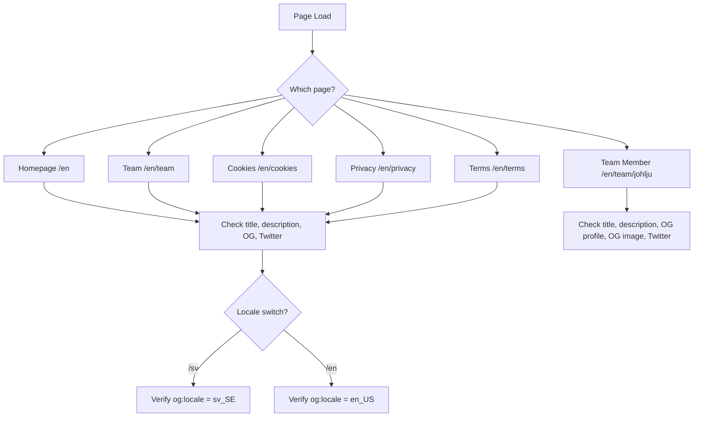

---

## Test Setup

No shared `beforeEach` hooks — each test navigates to the target page
directly via `page.goto()`. Tests rely on the Next.js development server
being available (started by Playwright config).

---

## Pages Covered

| Page         | Path              | OG Type | Twitter Card        |
| ------------ | ----------------- | ------- | ------------------- |
| Homepage     | `/en`             | website | summary_large_image |
| Team listing | `/en/team`        | website | summary_large_image |
| Team member  | `/en/team/johlju` | profile | summary_large_image |
| Cookies      | `/en/cookies`     | website | summary_large_image |
| Privacy      | `/en/privacy`     | website | summary_large_image |
| Terms        | `/en/terms`       | website | summary_large_image |

---

## Test Cases

### Homepage — should have page title with template suffix

**Purpose:** Ensures the homepage title contains the site name.

1. Navigate to `/en`.
2. Assert `document.title` contains "Viscalyx".

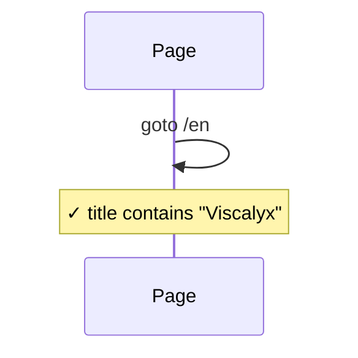

### Homepage — should have meta description

**Purpose:** Validates that a non-trivial meta description is present.

1. Navigate to `/en`.
2. Read `meta[name="description"]` content.
3. Assert it is truthy and longer than 10 characters.

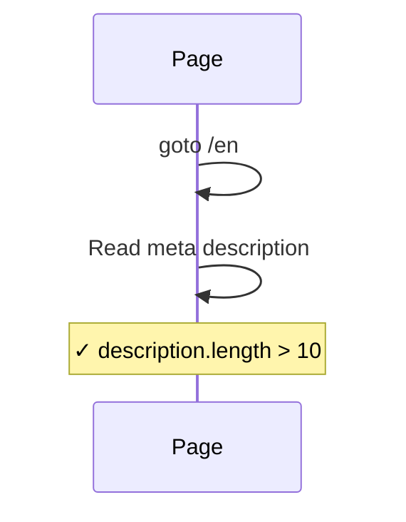

### Homepage — should have Open Graph metadata

**Purpose:** Confirms OG title, description, type, and locale are set for the homepage.

1. Navigate to `/en`.
2. Assert `og:title` and `og:description` are truthy.
3. Assert `og:type` is `website`.
4. Assert `og:locale` is `en_US`.

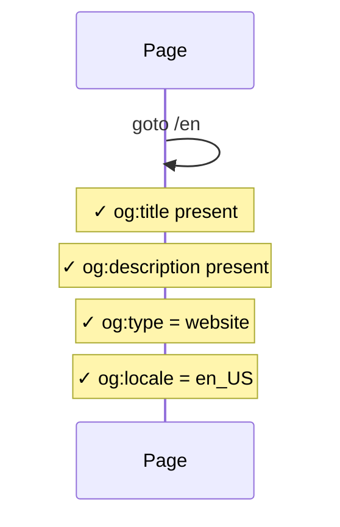

### Homepage — should have Twitter card metadata

**Purpose:** Validates Twitter card type is set on the homepage.

1. Navigate to `/en`.
2. Assert `twitter:card` is `summary_large_image`.

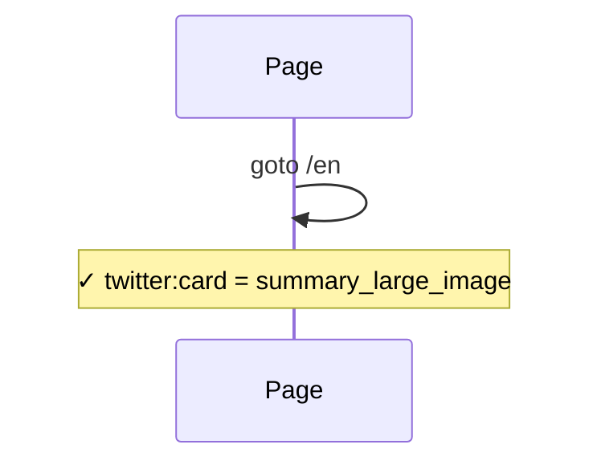

### Team Page — should have team-specific page title

**Purpose:** Ensures the team page has a unique title, not just the root fallback.

1. Navigate to `/en/team`.
2. Assert title contains "Viscalyx" and is longer than just "Viscalyx".

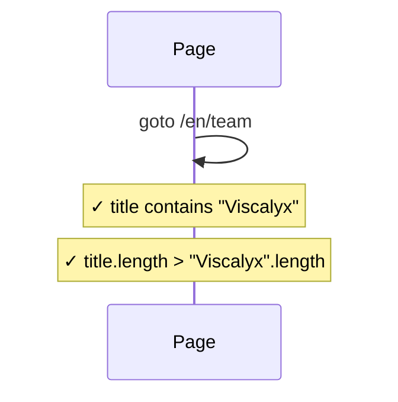

### Team Page — should have meta description

**Purpose:** Validates meta description is present on the team page.

1. Navigate to `/en/team`.
2. Assert `meta[name="description"]` is truthy and longer than 10 characters.

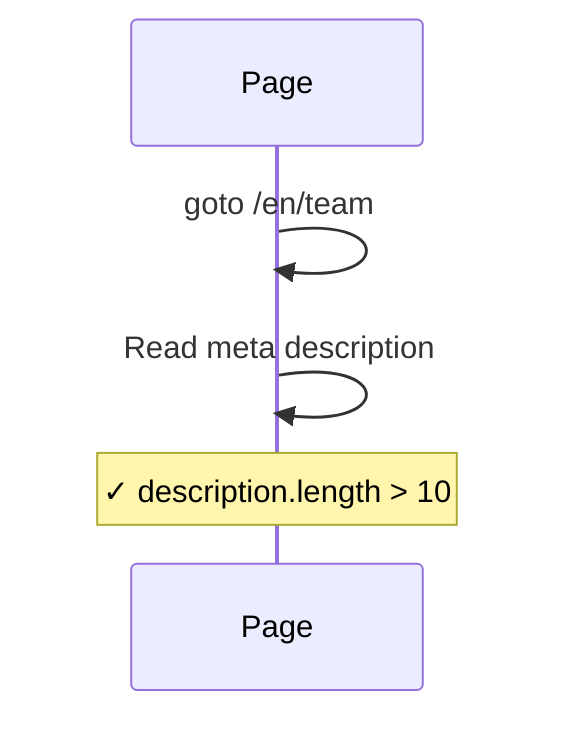

### Team Page — should have Open Graph metadata

**Purpose:** Confirms OG title and type are correctly set.

1. Navigate to `/en/team`.
2. Assert `og:title` is truthy and `og:type` is `website`.

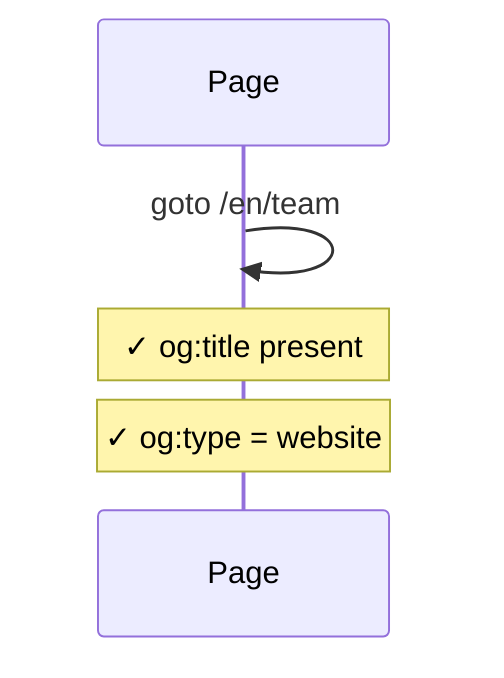

### Team Page — should have Twitter card metadata

**Purpose:** Validates Twitter card is present on the team page.

1. Navigate to `/en/team`.
2. Assert `twitter:card` is `summary_large_image`.

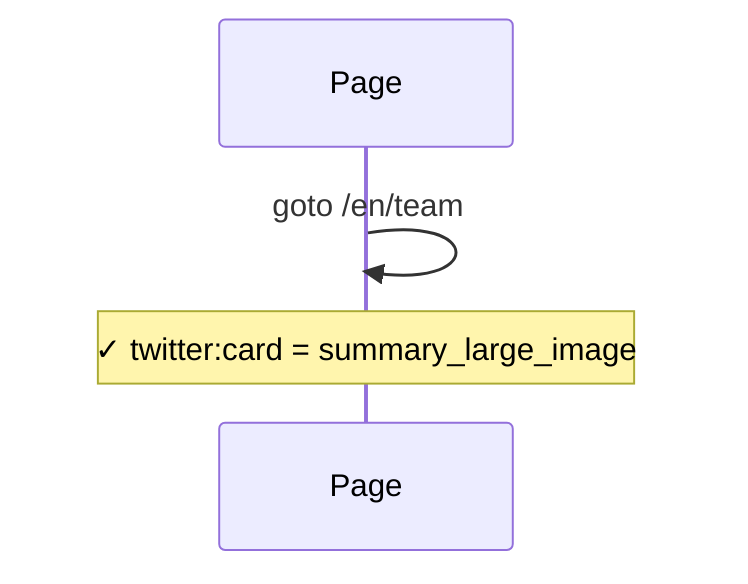

### Team Member Page — should have member-specific page title

**Purpose:** Ensures individual member pages have a unique title.

1. Navigate to `/en/team/johlju`.
2. Assert title contains "Viscalyx" and is longer than just "Viscalyx".

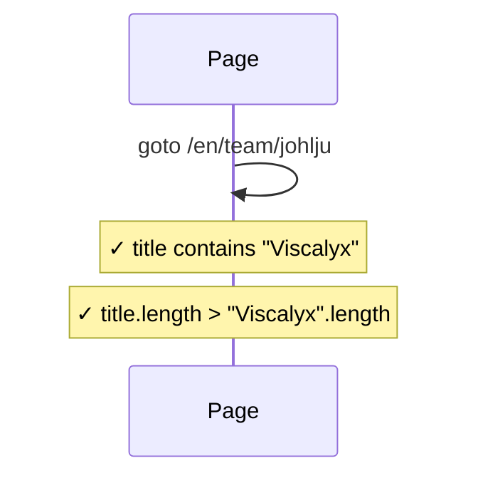

### Team Member Page — should have Open Graph profile type

**Purpose:** Validates that team member pages use the `profile` OG type.

1. Navigate to `/en/team/johlju`.
2. Assert `og:type` is `profile`.


### Team Member Page — should have member image in OG metadata

**Purpose:** Confirms that an OG image is present for team members with images.

1. Navigate to `/en/team/johlju`.
2. Assert `og:image` is truthy.

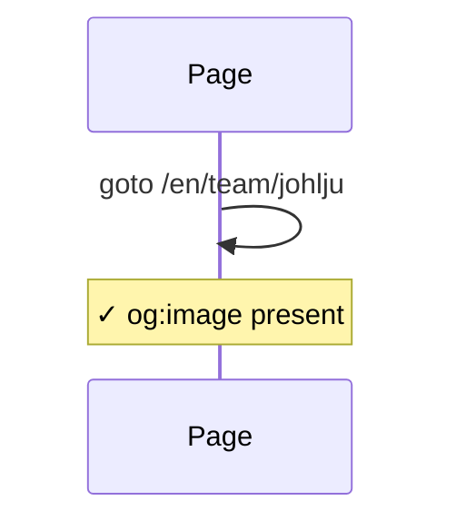

### Cookies Page — should have cookies-specific page title

**Purpose:** Ensures the cookies page has a unique title.

1. Navigate to `/en/cookies`.
2. Assert title contains "Viscalyx" and is longer than just "Viscalyx".

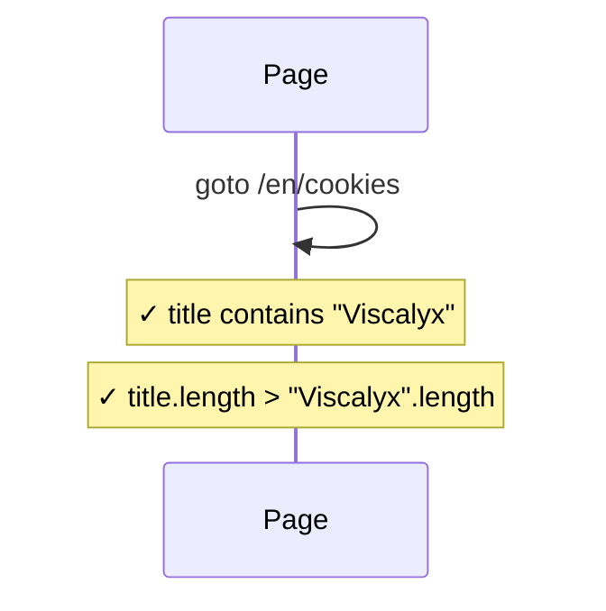

### Cookies Page — should have meta description

**Purpose:** Validates meta description is present on the cookies page.

1. Navigate to `/en/cookies`.
2. Assert `meta[name="description"]` is truthy.

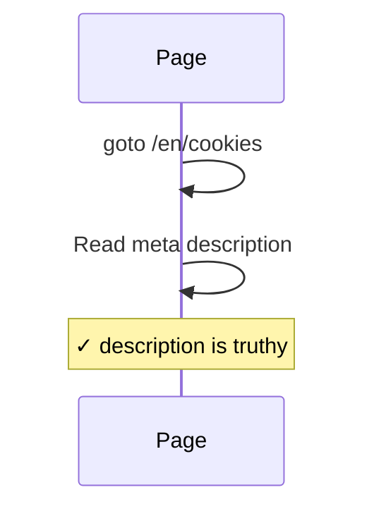

### Cookies Page — should have Open Graph metadata

**Purpose:** Confirms OG type is `website` on the cookies page.

1. Navigate to `/en/cookies`.
2. Assert `og:type` is `website`.

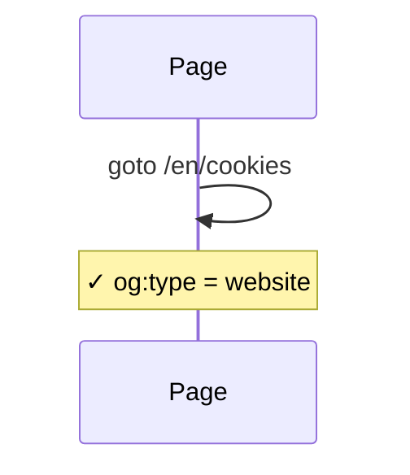

### Cookies Page — should have Twitter card metadata

**Purpose:** Validates Twitter card is present on the cookies page.

1. Navigate to `/en/cookies`.
2. Assert `twitter:card` is `summary_large_image`.

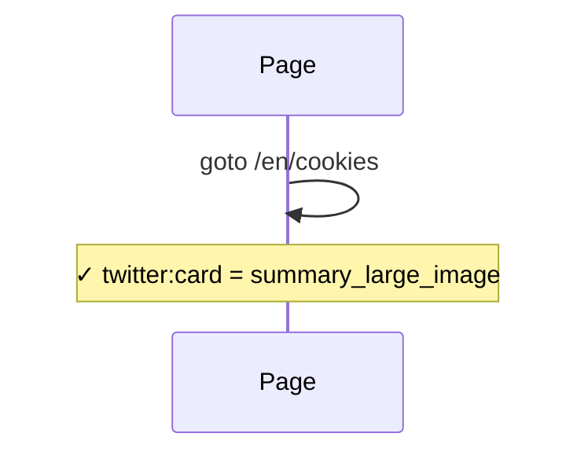

### Privacy Page — should have privacy-specific page title

**Purpose:** Ensures the privacy page has a unique title.

1. Navigate to `/en/privacy`.
2. Assert title contains "Viscalyx" and is longer than just "Viscalyx".


### Privacy Page — should have meta description

**Purpose:** Validates meta description is present on the privacy page.

1. Navigate to `/en/privacy`.
2. Assert `meta[name="description"]` is truthy.

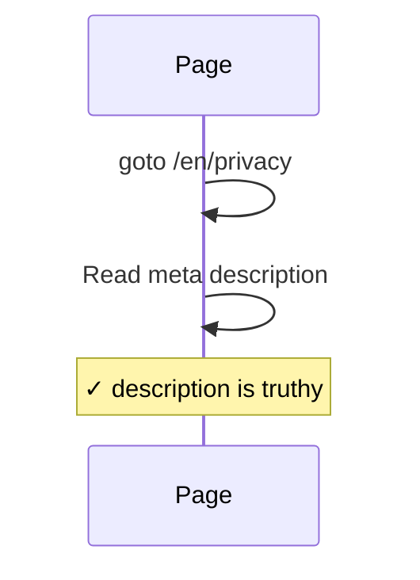

### Privacy Page — should have Open Graph metadata

**Purpose:** Confirms OG type is `website` on the privacy page.

1. Navigate to `/en/privacy`.
2. Assert `og:type` is `website`.

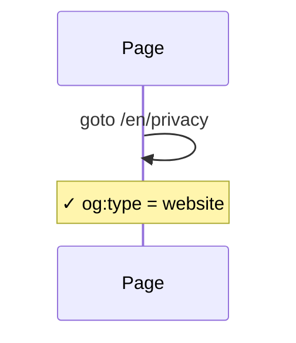

### Privacy Page — should have Twitter card metadata

**Purpose:** Validates Twitter card is present on the privacy page.

1. Navigate to `/en/privacy`.
2. Assert `twitter:card` is `summary_large_image`.

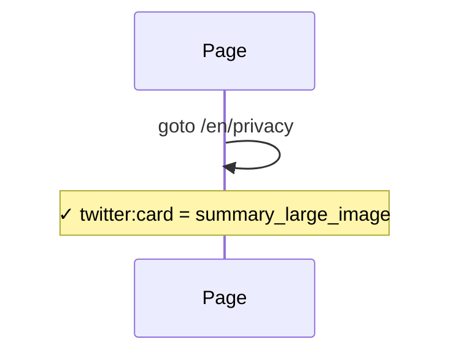

### Terms Page — should have terms-specific page title

**Purpose:** Ensures the terms page has a unique title.

1. Navigate to `/en/terms`.
2. Assert title contains "Viscalyx" and is longer than just "Viscalyx".

```mermaid
sequenceDiagram
    participant P as Page
    P->>P: goto /en/terms
    Note over P: ✓ title contains "Viscalyx"
    Note over P: ✓ title.length > "Viscalyx".length
```

### Terms Page — should have meta description

**Purpose:** Validates meta description is present on the terms page.

1. Navigate to `/en/terms`.
2. Assert `meta[name="description"]` is truthy.

```mermaid
sequenceDiagram
    participant P as Page
    P->>P: goto /en/terms
    P->>P: Read meta description
    Note over P: ✓ description is truthy
```

### Terms Page — should have Open Graph metadata

**Purpose:** Confirms OG type is `website` on the terms page.

1. Navigate to `/en/terms`.
2. Assert `og:type` is `website`.

```mermaid
sequenceDiagram
    participant P as Page
    P->>P: goto /en/terms
    Note over P: ✓ og:type = website
```

### Terms Page — should have Twitter card metadata

**Purpose:** Validates Twitter card is present on the terms page.

1. Navigate to `/en/terms`.
2. Assert `twitter:card` is `summary_large_image`.

```mermaid
sequenceDiagram
    participant P as Page
    P->>P: goto /en/terms
    Note over P: ✓ twitter:card = summary_large_image
```

### Locale Switching — should use sv_SE locale for Swedish homepage

**Purpose:** Validates that the Swedish locale correctly sets `og:locale`.

1. Navigate to `/sv`.
2. Assert `og:locale` is `sv_SE`.

```mermaid
sequenceDiagram
    participant P as Page
    P->>P: goto /sv
    Note over P: ✓ og:locale = sv_SE
```

### Locale Switching — should use sv_SE locale for Swedish team page

**Purpose:** Validates locale switching works on subpages too.

1. Navigate to `/sv/team`.
2. Assert `og:locale` is `sv_SE`.

```mermaid
sequenceDiagram
    participant P as Page
    P->>P: goto /sv/team
    Note over P: ✓ og:locale = sv_SE
```

## Running

```bash
npx playwright test page-metadata
```
